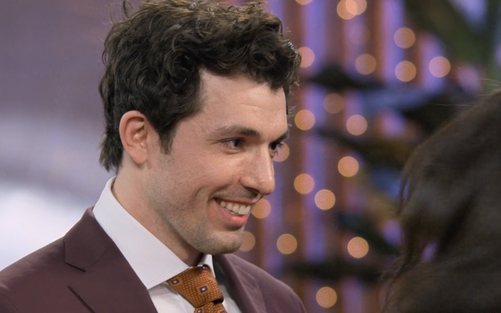
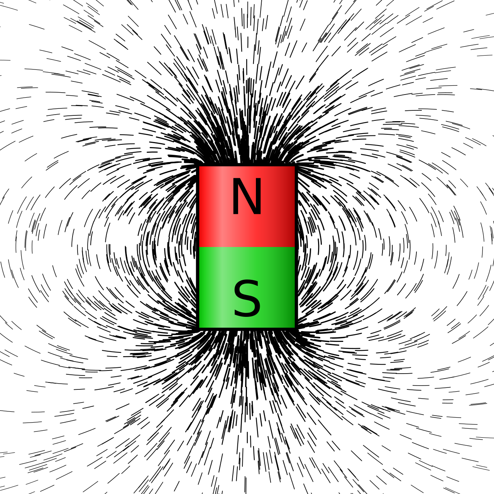

* CHAPTER FOUR:  "Text Generation"
** Polarization
Over 25 years ago, in the midst of the AIDS epidemic and the
government's lack of response, Eve Kosofsky Sedgwick wondered about
the point of doing critique in the first place. Even if critique could
expose governmental neglect of marginalized populations, that "the
lives of African Americans are worthless in the eyes of the United
States; that gay men and drug users are held cheap where they aren't
actively hated," Sedgwick writes, "what would we know then that we
don't already know?" (/Novel Gazing/ 3-4). In Sedgwick's work, this
question indexes a shift thinking around reading practices, from a
focus on knowledge, "Is a particular piece of knowledge true?," toward
method, "What does knowledge do--the pursuit of it, the having and
expressing of it?" (/Novel Gazing/ 4). Her new reading method, which
she famously dubs /reparative reading/, seeks out the productive power
of language---the power of language to coordinate seemingly unrelated
associations, to generate new meaning.

Over two decades later, in the age of automated text, this project
takes the prospect of /generation/ as an analytical method quite
literally. Whereas Sedgwick offers reparative reading in response to
the AIDS crisis, I pose text generation, specifically by automated
systems, as an apt hermeneutic for analyzing political polarization
today around debates on gender rights. This chapter uses text
generation as a analytical tool for surfacing where polarized
perspectives aournd gender might intersect. It does this because
machine learning, as I demonstrate below, transforms language into
what I call /aggregate forms/, which surfaces sites of potential
intersection among polarized points of view.

I will illustrate aggregate forms with an example. I trained a machine
learning model[fn:2] deliberatelly to express a progressive point of
view. When I ask this model to define gender terms like "Masculinity"
and "Femininity," it responds with the following outputs:
#+begin_quote
  Masculinity is a matter of love and celebration.

  Masculinity is a space for hope and liberation for all.

  Masculinity is not defined solely by the beauty of our bodies, but by
  the beauty of our experiences.

  Femininity is a celebration of beauty, feminine liberation, and
  femininity.

  Femininity is our joy, our struggle, and our fight is our struggle.

  Femininity is about allowing people to express themselves without
  government interference. (Appendix 1)
#+end_quote
The outputs from this model, which I trained on a feed of articles
about transgender rights that I scraped from the American Civil
Liberties Union (ACLU) website[fn:3], align with what one might expect
from a perspective that affirms gender diversity and expression. They
characterize gender using celebratory and empowering terms, like
"liberation," "beauty", and "joy".

Then, I trained another model[fn:4] to express a conservative point of
view. This model was trained on articles from the "Gender" topic page
at the Heritage Foundation.
#+begin_quote
  Masculinity is the cornerstone of Western civilization.

  Masculinity is the fruit of patriarchy, and patriarchy is the heart of
  conservatism.

  Masculinity is defined by the ability to produce sperm, eggs, and live
  children.

  Femininity is an enduring American tradition.

  Femininity is defined by means of the relationship between the sexes,
  the ability to raise their children, the capacity to provide for their
  own reproduction, the capacity to provide for their own children, the
  ability to provide for their own. (Appendix 2)
#+end_quote
Like the progressive model, gender is portrayed in a positive light:
it is a "cornerstone," "the fruit of patriarchy," and "enduring."
Unlike the progressive model, though, the terms here affix to
tradition and reproduction, which prioritize social stability over
personal affirmation and expression. Nevertheless, these differences
between the two models are what one typically expect between
mainstream conservative and progressive points of view.

However, the conservative model reveals a peculiarity that centers on
the term "subjectivity":
#+begin_quote
  Masculinity is a subjective self-perception, not a universal concept.

  Femininity is a subjective, internal sense of self.

  The gender binary is a subjective, malleable, and often incorrect
  idea.

  The gender binary is a subjective, internal, and often transitory
  concept.

  The gender binary is a subjective, grammatically incorrect and
  illogical concept that conflates sex and gender identity. (Appendix 2)
#+end_quote
This term, "subjectivity," appears in ways that one wouldn't typically
associate with the conservative viewpoint. In fact, the description of
the gender binary as "a subjective, internal, and often transitory
concept" directly contradicts current conservative positioning, which
overwhelmingly reifies that binary. For example, one of the articles
in the training dataset, entitled "Sorry Democrats, but Trump's 'Two
Sexes' Executive Order Is Constitutional" (see Fig. 1) refers to
recent Executive Orders, like "Defending Women From Gender Ideology
Extremism And Restoring Biological Truth To The Federal Government"
and "Keeping Men Out of Women's Sports," which define gender as
"binary and biological" (The White House 2025a, The White House
2025b).

In contrast to the conservative view of gender, these outputs more
closely resemble the progressive position. This position largely
associates gender as an identity that is internal rather than
biological. The American Psychiatric Association, for example, defines
gender identity as "a person's inner sense of being a girl/woman,
boy/man, some combination of both, or something else" ("What is Gender
Dysphoria?"). Similarly, the World Health Organization defines gender
identity as "a person's innate, deeply felt internal and individual
experience of gender," and contrasts it to biological sex, adding that
gender identity "may or may not correspond to the person's physiology
or designated sex at birth" ("Gender and health" 2025). In contrast to
the "binary and biological" perspective by the conservative side, the
progressive view defines gender as an internal sense.

Perhaps, the outputs not only refer to the progressive position, but
do so within conservative framing. Which explains why phrases of
derision, like "often incorrect" and "grammatically incorrect," append
descriptions of gender as "subjective," "malleable," and "internal."
The outputs reflect what a conservative believes a progressive person
believes gender is---an insubstantial feeling---which is "incorrect"
and therefore illusory. The outputs then present something like a
conservative caricature of the progressive position, a position that
Judith Butler usefully describes as a "phantasm," a psychological
complex, propped against the perceived slipperiness of gender and its
refusal to stay anchored to stable referents. According to Butler, the
assertion of sex as "binary and biological" attempts to foreclose this
instability by reasserting the body as a fixed ground (Butler, /Who's
Afraid of Gender?/). 

In fact, as this chapter will show, this pecularity in the model
outputs results from the machine learning training process and how it
absorbs the underlying training data. The outputs express not a single
perspective of gender, but an /aggregation/ of perspectives into a
single statement.

Figure 1. Screenshot of "Gender" topic page from the Heritage
Foundation. https://www.heritage.org/gender

** start TSQ

The ML training process that takes the language from the training
data, in this case, from articles with headlines like "Trump’s
Transgender Orders Are Well Within Executive Authority" and "Tyrants
of the Imperious Judiciary: Federal Judge Orders 'Gender
Reassignment'" (See Fig. 1 for more examples of headlines). It then
collapses the perspectives within these articles, which were written
by different journalists, into what seems like one perspective. The
outputs thus aggregate what are actually multiple perspectives into an
apparently univocal utterance.

I argue that this aggregative mechanism, which combines various
perspectives into one, constitutes a central constraint that drives
machine learning processes. Taking up this constraint, this chapter
re-works it toward another purpose: to surface commonality and shared
investments in perspectives based on gender and gendered embodiment.
It takes a deep look into the prediction mechanism, which drives
machine learning text generation processes, to trace how this this
mechanism of aggregation transforms individual language expressions.
It then applies this aggregative method on a dataset representing
cisgendered experiences of embodiment from the popular dating show,
/Love is Blind/. I chose this show, which features cisgendered,
heterosexual subjects, because of the unique way it foregrounds bodily
experience in desire. The participants of the show are placed in
individual "pods" where they are allowed to talk but not see the other
until they have agreed to get married. Until then, only have access to
only the other's voice.

** TSQ: remove references to previous chapter

Like the previous chapter, this chapter also enlists heterosexual
subjects to the work of queer analysis. The previous chapter made the
argument under criteria of sex and desire: that the mode of desire and
intimacy (in one case, the tripartite sexual union between humans and
Oankali; and in the other, the digital messages exchanged between
/Entropy8Zuper!/) disturbs traditional notions of consent and pleasure
in heterosexual dynamics. This disturbance is made visible through the
clash of material and symbolic registers, in both embodied sensation
and in technological processing. In those explorations, "queer"
denotes a destabilization of the norm based on a re-grounding in
materiality. This chapter makes another argument about heterosexual
dynamics. This time considering subjects that many would perceive to
be the most normative of the heterosexual type---participants in a
reality TV dating show which ends in a wedding. However, this chapter
posits that the show undergirds its normative teleology with a
transgressive premise based on the main gambit that "love is blind."
The "blind" dating environment, which prevents participants from
seeing each other until they have agreed to get married, effectively
poses the body as a dependant variable in a dating experiment that may
or may not end in a successful union. In other words, the absence and
then subsequent presence of the body becomes the determinant for
heterosexual apotheosis.

For that reason, the language models that I used to analyze the show
were designed and trained to explore the role of the body in
heterosexual dating dynamics. Similarly to the two models that I
trained on conservative and progressive perspectives, I trained two
different models based on different phases of the show: one model on
the "blind" phase of the dating experiment, and one on the phase where
the participants meet and date in person. I partitioned the models in
this way deliberately so that I could study how the presence of the
body affects the heterosexual dating experiment. I then pose to both
models various questions about embodiment, desire, and commitment.
Despite the heterosexual and apparently cisgender conformity of the
show's participants, the show enacts what I think is a fascinating and
non-normative experiment about embodiment and desire: an experiment
which explores what happens to the body when it falls in love from
behind a wall. To analyze what happens to the body, I take
theorizations of bodily dissonance from Trans Studies and apply them
to an analysis of these cisgendered, heterosexual daters. I examine
what their dating situation, where visual access to the beloved is
denied, does to the self-perception of the body. I find that this
"blind" dating experiment places participants in a state where their
own bodily coherence fractures, which has consequences on their
romantic trajectory and aspirations. While firmly anchored to their
cisgendered identities, the participants undergo a split in the
physical body, which begins to accrue investments to integrity and
wholeness that inevitably go unfulfilled once they are united with
their beloveds.

The bodily disjunctions which the cis participants experience ally
them with trans experience, if only for a time. When they are severed
from the visual sense of the other, they experience a disruption of
bodily perception that places them in a temporary version of what Jay
Prosser calls the "transsexual trajectory" (6). For Prosser, this
trajectory "bring[s] into view the materiality of the body" in ways
related to feelings of bodily dissociation and dysphoria. Although
/LiB/'s cisgendered subjects are anchored to their sex-gender
identities throughout the show, I argue that they undergo an
experience of sensory bifurcation that brings the body to apprehension
in a new way. That the the moment that they enter the pods and
experience romantic desire that is foreclosed from the sense of sight,
they are placed on the "route to identity and bodily integrity"
(Prosser 6).

** Aggregation
To study the language of the /Love is Blind/ participants, I trained
some small language models to generate text that mimics their speech.
First, I gathered the transcripts of the show by scraping them from a
website.[fn:10] Then, I used the transcripts to train models from an
open source "base model" called GPT-2. (All of the code, datasets, and
resulting models are released online under an open licence.)[fn:5] The
resulting text generators synthesized common patterns and shared
investments from the language in the show transcripts, a process I
explain in more detail below.

Although my methodology uses Machine learning (ML) technology, I do so
in explicit resistance against the wasteful practices and attitudes
that drive ML adoption today. The dominant mentality driving ML
adoption, what Gael Varoquaux et al. describe as the "bigger-is-better
mentality," comes from the belief that more data (scraped from the
internet) and more "compute" (Graphical Processing Units, or GPUs,
sourced from deep Earth minerals) will lead to better performing
models. The drive for larger models has spurred more and more
investment, which has inflated the economy to what some project are
bubble-bursting levels, as many tech companies like OpenAI run on pure
investment and do not project to be actually profiting from their
product for several years (Casselman). Additionally, as recent
research points out, this bigger is better drive is counter-intuitive:
Large Language Models actually have a ceiling in terms of how size
affects performance, that ever-increasing compute does not yield
comparable returns in terms of the quality of model outputs (Varoquaux
et al.). Which makes the tech companies all the more desperate to
protect their investments at all costs. Together, general ignorance
about so-called "AI" and market incentives combine to fuel what Emily
Bender and Alex Hanna have usefully termed "AI hype"---a
self-reinforcing and perpetuating mechanism driven by ignorance about
how models actually operate and capital's desperation for profit above
all else.

This project rejects the high consumption mentality, opting instead
for small models and datasets, and for deliberate attention to how
ML's central mechanisms operate under the hood. The LLMs that I use
for this project, which I cheekily call "small language models"
(SLMs), were trained on a single laptop, over a single afternoon. For
training, this project used a base model, GPT-2, released in 2019
under an open license, with the size of 1.5 billion parameters.
Compare that size with models released since then, like GPT-3, a
proprietary model released in 2020, which jumped in size to 175
billion parameters. As of this writing, the most recent GPT is
GPT-5.2, released in December 2025, which is estimated to be somewhere
between 2 trilion and 5 trillion parameters, a number that cannot be
verified due to the proprietary (i.e. closed) status of the model.
Additionally, in contrast to GPT-2, which was trained off 8 million
webpages, experts agree that GPT-5.2 is trained on something like the
entire internet, although this cannot be known for sure, due to the
secretive nature of the training process.[fn:9] The dataset which I
used for training my model based on GPT-2 was also small in size,
containing the transcripts from 14 episodes from the show, from a
single season. While a commercial model would need more data to create
more complex and seamless responses, that was never the goal of this
project. Although the small size of the model and the dataset means
that the results will be full of quirks and peculiarities, they offer
excellent opportunities for close-reading analysis, as I explain
below.

Which brings me to my main point: that this project, in contrast to
current commercial methods, uses ML a /reflexive/ tool. The current
emphasis on using machine learning as a tool for productivity, to
generate new content, while serving extractive and monetizing
purposes, misses the fact that these tools are designed primarily to
reflect the data that it is trained on. As Wendy Chun points out,
predictive tools are good for studying existing patterns in data. Her
work, which carefully traces the eugenicist origins of statistical
processes,[fn:7] the foundation for all machine learning technology
today, proposes that these tools be used for revealing patterns that
are harmful so that one might act differently. She offers the example
of one knowledge area which already does this work: climate change
modeling. Here, she asks: "How can we treat machine learning systems
and their predictions like those for global climate change? These
models offer us the most probable future given past and current
actions, not so that we will accept their predictions are inevitable,
but rather so we will use them to help change the future" (26).
Although my language models are distinct in kind from climate models,
they shares a focus on evoking patterns in data as a means of learning
more about that data.

In addition to being reflexive, this project argues that ML processes
are "normalizing." My approach takes takes ML's inherent reflexivity,
a computational process, as an analogue to social pressures and drives
that constitute normativity and the desire to achieve and express
social norms. Prediction algorithms are designed to find and amplify
the most frequent patterns of word usage. They are driven to distil
the dominant tendencies and perspectives into the generated outputs.
The predictions thus represent an approximation of what is most
typical or natural in training data. As a kind of normalizing
mechanism, prediction is particularly an apt tool for studying shared
desires---in my case, with the /LiB/ subjects, for studying a shared
desire for marriage. 

I will now demonstrate an example how this normalizing mechanism works
to generate approximations of language patterns. When I prompt the
model, which I trained from the show transcripts, with the phrase
"Marriage is," it then generates the following outputs:
#+begin_quote
  Marriage is not an easy decision.

  Marriage is not a celebration.

  Marriage is a lifelong commitment. (Appendix 4: Postpod prompts)
#+end_quote
While production-level models like Chat-GPT are trained specifically
to respond to prompts in full sentences, creating a dialogue between
the user and the model, more rudimentary models like GPT-2 will only
offer continuations to a given prompt. From the completions that it
does offer, none of them appear directly in the transcripts of the
show. Rather, the completions are aggregated from phrases that appear
in similar contexts with the word "Marriage" in the transcripts. Which
is precisely the goal of language modeling: instead of reproducing
verbatim expressions, the model generates approximations of
expressions within the transcripts. These approximations are a result
of calculations, a series of statistical calculations, which determine
the word that is most likely to appear next.

Inside the model, language is represented in a numerical form, in what
is technically called a "word vector." Word vectors are how a machine
learning knows what words mean individually, they comprise the model's
internal dictionary, so to speak. The vectors themselves consist of a
large and complex list of numbers representing probability scores.
Each of the numbers in the vector indicates a given word's association
to another word in the dataset. For example, "marriage" may have a
higher association to the word "commitment," and lower probability
scores with other words like "apple" or "jogging."

#+begin_quote
|          | commitment | apple | jogging |
| marriage |        .90 |   .10 |     .15 |
#+end_quote

The association between "marriage" and "commitment" is high, at 90%,
while the association between marriage and two other words, "apple"
and "jogging," are much lower, at 10% and 15%, respectively. There is
a slightly higher association between "marriage" and "jogging,"
because both are strongly associated with activity done specifically
by humans. The word vector for "marriage," combines all of these
probability scores into one numerical expression: .90, .10, 15. For a
real LLM, the word vector would be much longer, comprising thousands
of probability scores, each one representing that word's association
to another word in the dataset. These long word vectors, and the
massive files used to store them (which range from a few to hundreds
or thousands of Gigabites in size), are the reason why Lanugage Models
are prepended with the word "Large."

In order to generate the word vectors, models adjust their numerical
representations iteratively over a long training process. There are
three steps to the process: (1) hypothesis, (2) loss, and (3)
optimization. First, in the hypothesis step, the model takes a sample
sentence from the training data, in this case a sentence that starts
with "marriage is" from the transcripts, like "marriage is not easy"
and it blocks out the second half of the sentence, so that only
"marriage is" remains (/Love Is Blind/, Season 2, Episode 14). It
tries to guess what should go in the second half, perhaps guessing
with the phrase, "Marriage is an apple." The guess will be wrong, but
that doesn't matter for now. Moving to the next step, loss, it checks
its prediction against the actual sentence, "Marriage is not easy."
Refering to its database of word vectors, it calculates the difference
between the vector for "an apple" and "not easy." In this case, the
"loss" represents the difference between the original completion and
the guess, or the mathematical difference between the vector for "not
easy" and the vector for "apple." Then, it moves to the final step,
optimization. Here, the model uses an algorithm to calculate the
smallest adjustment possible that it can make to the vectors so that
they are just slightly closer to the original completion. The
adjustment is miniscule, but it is precise. At each step, model slowly
closes the gap between its prediction and the original training
example.

The model repeats these three steps over and over until it attains the
most accurate vector possible for a single word. It tries out many
words, perhaps every word in the dataset. With each guess, the model
makes very slight adjustments to its own representation of word
meaning (this constant iteration, and the computer processing required
to do it, is why language models take lots of time, energy, and
computer hardware to train). By the end of the training process, the
list of probabilities will reflect a kind of average, or aggregation,
of that word's association to other words.

For the prompt, "marriage is," the model will ascertain possible
completions for this phrase, given other words that are associated
with "marriage" in the dataset. One actual completion it gives, "not
an easy decision," resembles--without exactly reproducing--the
training example, "Marriage is not easy" (generating outputs that
mimic the training data is undesirable model behavior, technically
called "overfitting," which I discuss in detail below). Rather than
repeating the training sample vertbatim, the generated output reflects
the model's internal associations between "marriage" and the concept
difficulty, to produce "Marriage is not an easy decision."

Tracing the origin of this phrase, "Marriage is not easy," will help
to illustrate how the model picks up context clues from language and
absorbs them into the word vector representation. The phrase
originally appears during the most trying period of the show, when the
couples are living together prior to the wedding. Moving beyond the
pods and romantic Mexico, this encounter with the outside world brings
unpredictable dynamics like family, work, and lifestyle to factor in
the new relationships. For most of the couples, it is enough to
dissolve the deep but brief emotional connection that they developed
in the pods. For one couple, Jarrette and Iyanna, the exposure to the
others' lifestyle habits--specificaly Jarrette's partyboy ways--has
negative consequences. At the end of the season, Jarrette explains
that,
#+begin_quote
  Marriage is not easy. Over the past couple of months, like, I've
  definitely been struggling with coming in late, um, and just
  overindulging when I'm out. I haven't been the best at prioritizing
  us. And, uh, it got to a point where Iyanna moved out. (Season 2,
  Episode 14)
#+end_quote
The words associated with "marriage" in this context will have an
influence the model's vector for that word. Whatever prior
understanding that the model had for "marriage," it will now expand to
include stronger associations to terms like "struggling,"
"prioritizing," with perhaps an inverse effect on its relationship to
the term "overindulging," (which is, in this case, a euphamism for
Jarrette's nighttime carousals). The model absorbs this context for
the word "Marriage" so that when prompted, it model generates
completions like,
#+begin_quote
Marriage is not an easy decision.

Marriage is not a celebration.

Marriage is a lifelong commitment. (Appendix 2: Postpod prompts)
#+end_quote
These approximations are, I argue, a /normalization/ of language. The
model's guessing mechanism approximates word meaning from various
samples, even beyond Jarrette's quote above, to include language
spoken by other participants, examples like "Marriage isn't just about
love, love, love", and "Marriage is a huge thing" (Season 2, Episode
8, "Final Adjustments"). The model generates its completions by
approximating what is most likely, most plausible, based on these
training samples. Through the slow churning of word vectors, making
guesses and optimizing losses, the model ascertains an average
expression that faithfully reflects the perspectives around marriage
from the show. This expression represents aspects about marriage which
are most frequent and most shared, in my reading, most "normal,"
between the participants.

I now turn to another field, far removed from ML, which is also
concerned with certain processes of normalization: Trans Studies. This
field, according to some scholars, characterizes subjectivity via
attachement to norms. As Andrea Long Chu puts it: "Trans Studies
requires that we understand—--as we never have before—--what it means
to be attached to a norm, by desire, by habit, by survival" ("After
Trans Studies" 108). Trans Studies scholars have frequently described
trans subjects and trans subjectivity as constituted by normative
experience of sexed embodiment, what Jay Prosser calls "sexed
realness" (47). For Prosser, "sexed realness" means having the body
and being able to pass in accordance with one's identity. According to
this scholarship, the trans experience is characterized by a longing
for embodied integrity.

The emphasis on normativity is one quality that distinguishes Trans
Studies from Queer Studies. Trans Studies, famously referred by Susan
Stryker as Queer Studies "evil twin", has a repuation for rebelling
against the traditional investments of Queer. According to Eliza
Steinbock, "trans" orients itself differently around its own set of
investments:
#+begin_quote
“trans analytics have (historically, though not universally) a
different set of primary affects than queer theory. Both typically
take pain as a reference point, but then their affective interest
zags. Queer relishes the joy of subversion. Trans trades in
quotidian boredom. Queer has a celebratory tone. Trans speaks in
sober detail.”
#+end_quote
(Add: Kadji Amin, from "Disturbing Attachments".) Unlike "queer,"
"trans is not so concerned with resistance: rather it wants "quite
simply, to be," in Prosser's words (Prosser 32).

This desire "simply, to be" perhaps explains why Queer Studies tools
are not well suited to studying trans investments. Despite its
focus--indeed, obsession--with gender and sexuality, Queer Studies has
a history of overlooking the body, the experience of gendered
embodiment, in favor of discursive explorations and forms of gender.
One of Queer Studies' sharpest tools, the field-defining concept of
Gender Performativity, for example, has been thoroughly critiqued by
Trans Studies scholars like Prosser. Prosser argues that while Gender
Performativity takes gender crossing seriously, the material body
often remains irrelevant to this theorizing. In a trenchant critique
of Butler's reading of Venus Xtravaganza, who Butler argues is a
subversive figure, Prosser points out that Venus's /subversion/
depends on how one reads her transsexuality: whether one reads Venus
as how she indicated she wanted to be read, that is, as a woman, or
whether one reads her as an "incomplete" MTF transsexual. Prosser
explains that "What matters for Butler is the oscillation between the
literality of Venus's body and the figurative marks of her gender"
(49). As a result, Prosser argues, "Butler figures Venus as subversive
for the same reason that Butler claims she is killed," a stance that,
according to Prosser, "verges on critical perversity" (49).

For Prosser, what matters is not that Venus's body occupied an
ambiguous space between here and there, a space which has been
alternately literalized and metaphoricized in dizzying movements
toward and away from the sexed body, but rather than transsexuality is
discussed in terms of that which it avoids: subversion. Prosser points
out that Gender Performativity's focus on boundary crossing "cannot
account for a transsexual desire for sexed embodiment as /telos/"
(33). In other words, it cannot account that for Venus "her desire--to
be a complete woman for a man--is heterosexual, and it is more this
desire in combination with her transsex that kills her" (Prosser 47).

More overtly than Queer Studies, Trans Studies foregrounds how the
desire for normativity, the desire to pass, inflects the experience of
embodiment, and especially of embodied disjunction, what is often
referred to as gender or body dysphoria. Here, Prosser offers a useful
model characterizing dyphoria as a conflict between the physical body
and what he calls the "body image" (12). While the physical body is
what we already know as the corporal mass of the body, the body image
is an internal representation of this corporeality, one that comes
with its own set of somatic registers. Despite being internal, the
body image is experienced as a sensual phenomenon, emerging in
surprising ways on the surface of the body. This body image, according
to Prosser can "transform fleshly matter and inscrib[e] its struggle
on the material body... exterioriz[ing] what is conceived as internal"
(71). His example of this phenomenon comes from the memoir of Raymond
Thompson's autobiography, /What Took You So Long?/ (1995), from a
scene where the author experiences the physical body as a "false outer
skin" that encloses the true "inner body," the body image (69):
#+begin_quote
In a remarkable instance of quasihysterical symptomization, Thompson's
narrative literalizes this psychic/corporeal inside-out-ness. Rising
from his bed, seeing his reflection in the mirror, Thompson finds his
face covered with weeping blisters... Not simply marking the
dissociation between physical body and body image, the blisters
reproduce in their very microstructure that dynamic of an inner body
pushing up against, trying to escape from the material outer body:
vesicles filled with bodily fluids bursting up and out from their
internal course through to the body's surface, overflowing their
assigned passage. 71
#+end_quote
In this narrative, Prosser explains, the blisters manifest the
"conflict between the true body within and the false body without,
between sentient body image and insentient visible body" (70).
According to Prosser, the body image "clearly has a material force for
transsexuals," one that often manifests in the trope of being "trapped
in the wrong body" and feelings of dysphoria (69).

That trans experiences are driven by a desire for embodied belonging
is one way that it distinguishes itself from queer, which historically
has sought subversion and rebellion. This key difference between queer
and trans opens a natural alliance between trans and cis subjects, as
the next section endeavors to demonstrate through close readings of
the cisgendered dating show, /Love Is Blind/.

** Sensory splits
For this project, I trained two language models to distinguish between
the two phases of dating on the show: the "blind" phase, when
participants date from within their respective "pods," and the
in-person phase, when participants meet and live together in
preparation for the wedding. I call the first model the "pods model"
and the second model the "post-pods model."[fn:8] In what follows, I
will explore how these models respond to prompts related to the topic
of embodiment, focusing specifically on language around terms like
"physical touch," "touch," "body," and "intimacy."

First, there is a peculiar pattern with how the two models respond to
the concept of touch. When prompted with phrases like "When I touch
you," and "Physical touch is," and "Physically," the pods model
generates the following outputs:
#+begin_quote
  When I touch you, I feel it.

  When I touch you, I feel your energy, and it is, like, I'm just so
  happy.

  When I touch you, I can feel your soul, your heart, and your soul
  aligning so well.

  When I touch you, I feel you, and I feel you, I feel you, and I feel
  you.

  Physical touch is important to me.

  Physical touch is the most important thing.

  Physical touch is so sexy.

  Physical touch is like a glove.

  Physically, we are so happy. (Appendix 3)
#+end_quote
In these responses, "touch" is described as something highly desired,
"important," "most important," and even "sexy" quality. It is also
associated with non-tangible phenomena, like "soul" and "energy."
These associations are perhaps expected when one considers that the
model was trained on the phase of the show when no actual touching
occurs between the couples. Being foreclosed from the participants
during this stage of the experiment, "touch" is elevated and
idealized, taking associations that transcend the physical realm.

The model's prediction mechanism, which generates these approximations
from the show transcripts, also reveal some quirks in the
outputs---quirks that one almost never encounters in a larger,
production-level models that have gone through many rounds of
fine-tuning. Repetitions like, "When I touch you, I feel you, and I
feel you, I feel you, and I feel you," are in fact expected behavior
in text generation models. Because text generation is based on
guessing what is most likely, on approximating the most plausible next
word, the model will repeat the same phrase over and over again. A
corollary to the prediction process is a phenomenon known as
"hallucination," when a language model spews text that has no bearing
in reality. Like repetition, hallucination is based on the model's
inherent prediction processes. They hallucinate because they are
designed from statistical processes to make guesses, to produce what
is most plausible, rather than most accurate.

In contrast to the pods model, the post-pods model puts touch in very
different contexts, associating it with strangeness and even
repulsion:
#+begin_quote
  When I touch you, I feel like I'm in my head.

  When I touch you, like, I feel like I'm literally in my head.

  When I touch you, you just feel like it's so weird.

  When I touch you, it feels like a jab.

  When I touch you, it feels like something I'm about to get up and walk
  away.

  When I touch you, I feel like it's like I've just, like, left the
  room.

  When I touch you, the thing that's scary is, like, it's a physical
  thing.

  When I touch you, you're like "I'm blinking." (Appendix 4)
#+end_quote
While in the pods, touch draws the characters together, evoking
non-tangible phenomena like the soul and energy, here it seems that
touch repels the characters from each other. Touch is strange and
jarring, "so weird," "like a jab"; associated with "scary"
physicality, and signals movement, "walk away," "left the room."

Like the pods model above, these outputs also reveal their own quirks.
For example, the phrase "I'm blinking" is taken directly from the
show, and offers an example of an undesired but not uncommon blip in
the prediction process called "overfitting." In machine learning, when
a slice of text from the training data, in this case, the show
transcripts, is generated verbatim in the outputs, it is not
considered to be a good thing. Rather, it indicates that the model is
/too/ accurate, slipping from making predictions that are plausible to
ones that directly repeat the data it has been trained on. A model
overfitting in its outputs is generally a sign that there isn't enough
training data or enough variation in the training data, so that the
model has less examples from which to generalize. As a consequence, it
resorts to reproducing direct examples from its training. This is a
quirk that a larger model, which has been trained on many more
examples than these models, is more likely to avoid.

For my purposes, overfitting is not only a blip, it also points to a
specific scene in the show that dramatizes the tension between sight
and physical attraction. The original reference to "blinking" appears
in a scene with the newly engaged couple, Zach and Irina, when they
meet each other for the first time in person (see Figs. 2-5). The
doors open, and they awkwardly approach each other down a red carpet.
After exchanging their first greetings, they have a conversation about
their reaction to each other's appearance:
#+begin_quote
  Zach: Do I look like what you thought I'd look like?

  Irina: I had no guesses of what you looked like.

  Zach: Oh!

  Irina: You have, like, the blankest stare in your eyes.

  Zach: Really?

  Irina: I'm just kind of taking it all in.

  Zach: Me too.

  Irina: You look like a fictional character. You look like something
  out of a cartoon.

  Zach: I know.

  Irina: You have to blink!

  Zach: I am blinking.

  Irina: You don't blink. You look like this.

  Zach: I am blinking. I will try not to be too intense. (Season 4,
  Episode 4, "Playing with Fire")
#+end_quote
Right off the bat, Zach seems a bit insecure of his appearence, asking
if he looks how Irina imagined. And Irina, in turn, describes him as a
"fictional character... like something out of a cartoon"---a peculiar
choice of words that could indicate a her sense of super-reality about
his physical appearance. Perhaps Zach appears overly expressive or
stylized in some way. Perhaps, the visual reality of him is too much.
Blinking is, after all, a way of stopping the entry of visual data, of
occluding it from the eyes' perception. For Irina, the request for
Zach to blink might indicate her own sense of overwhelm at his
physical form, at his sudden incorporation from behind the wall.
Maybe, projecting her own feelings of overstimulation, she asks him to
blink.

Figure 2. Screenshot from /LiB/ season 4, episode 4: "Playing with
Fire".

Figure 3. Screenshot from /LiB/ season 4, episode 4: "Playing with
Fire".

Figure 4. Screenshot from /LiB/ season 4, episode 4: "Playing with
Fire".

[[./sitting.png]]
Figure 5. Screenshot from /LiB/ season 4, episode 4: "Playing with
Fire".

Following the story of Zach and Irina's relationship, it becomes clear
that the catalyst for their breakup is a lack of physical attraction
on the part of Irina. One interaction between Irina and Michah, a
woman who is coupled with another participant on the show named Paul,
suggests that her lack of physical attraction has to do with a
paradoxical relationship between her sense modes--between what she
sees and how she feels when she is around Zach. Later in the same
episode, Irina explains her feelings to Micah.
#+begin_quote
  Irina: And so, Zack. I feel like is my type on paper. Has, like, brown
  hair, brown eyes, like, chiseled face. Like, I really like dark
  features. And the moment I saw Zack, it was like, "I don't know who
  this man is." And I was like, "Maybe it's just scary, and it was a
  lot." Like, hopefully it's gonna grow, but I've noticed every time he
  does, like, touch me, I get, like, major ick. When he puts his arm
  around me at night, I literally was like-- like, my heart stopped. And
  I literally go... But not, like, in an excited way.

  Micah: I wanna, like, relate to you in a way, but it's always, like,
  so different.

  Irina: How was it with you and Paul?

  Micah: The thing with me and Paul is, like, we both, like, had such an
  immediate understanding as best friends.

  Irina: Yeah, Paul's gorgeous. (Season 4, Episode 4, "Playing With
  Fire")
#+end_quote
Irina's explanation here weaves between sensory modes: In contrast to
Irina's reaction from their first meeting, Zach now has all the visual
aspects that she finds attractive, "brown eyes, chiseled face."
Nonetheless, something about him nonetheless repulses her; when he
puts his arm around her, she experiences an embodied reaction of
recoil, "get[ting] major ick." Micah then suggests that her own
chemistry is emotional, based on "an immediate understanding as best
friends." Irina responds by seeming to agree, but she also conjures
back the importance of visual appearance with the phrase, "Paul's
gorgeous." While it /appears/ that emotional attraction can overcome
lack of other kinds of attraction, this does not seem to be the case
with her and Zach.

Maybe, Irina's physical repulsion to Zach results from her experience
in the pods, from being unable to see him during their initial
courtship. Perhaps, without visual access to her beloved, the other
sensory modes, particularly touch, becomes heighted. And this effect
is shared among the participants at large, who all experince a strange
relationship to their own bodies from within the pods. When prompted
with the phrase "My body," the pods model generates the following
completions:
#+begin_quote
  My body feels like it's coming off.

  My body feels heavier.

  My body feels so different now.

  My body feels weird.

  My body makes me feel like it's real.

  My body feels torn between two different people. (Appendix 4)
#+end_quote
There is an increased awareness of the physical body coming into
apprehension in a novel and visceral way. And the heightened sensation
of the body paradoxically creates a feeling of the body's strangeness,
"weird" and "so different now," and even its dissolution, "like it's
coming off"--a sense of rupture recalls Prosser's description "body
image" as "radically split off from the material body" (Prosser 69).
Perhaps, for these straight, cisgendered participants, the body is
coming into sentience in a way that is not possible when they are
fully integrated, with all senses in tact, outside the pods.

While the /LiB/ participants are firmly cisgender (as far as I can
tell), the pods environment nonetheless cuts them from the visual
layer of their own bodies, what Prosser calls the "insentient visible
body." In that absense, inner bodily sensation, the "sentient body
image," comes to the fore. These participants experience not only the
physical body, the material reality of their physical body which
they've always known; they experience another register of the body, a
register that was always there but previously unknown to them, below
the visual layer. In addition to referring to the choice between two
potential romantic partners (a dilemma--along with love
triangles--that crops up in every season of the show), perhaps the
output describing one body "torn between two different people" also
suggests a /single/ person with two bodies in tension. The sensory
deprivation of being in the pods creates the conditions for the
participants to experience this bodily disjunction, perhaps for the
first (and only) time in their lives.

It is not an experience that lasts long. In the postpods model, the
body appears to be re-integrated. The outer body comes into view,
reflecting the shift where the participants are literally given visual
access to each other. Here, the language about the body shifts in a
striking way into more visual, as well as more positive, descriptions:
#+begin_quote
  My body is gorgeous.

  My body is so cute.

  My body is so pretty.

  My body makes me feel lighter, more confident.

  My body makes me feel warm.

  My body makes me feel like I've missed my train. (Appendix 4)
#+end_quote
The outputs address the body in concise and flattering terms: the body
is "gorgeous," "so cute," "pretty." Now that the visual sense has been
re-incorporated to the body, it becomes the dominant sense modality.
Additionally, the body feels "lighter" and "warm," offering coherence
where before was weirdness and weight, perhaps because the couples can
see each other. In the final output, however, there is a sense of
something not quite right: "My body makes me feel like I've missed my
train." This statement, with its slightly nostalgic undertone,
suggests that even when coherence is gained, something is lost.

What is lost is the notion of the physical, especially that of
physical touch, as it becomes supplanted by the visual sense. Here,
the post-pods model frames touch in terms of unfulfilled desire:
#+begin_quote
  Physical touch is everything that I've wanted in a wife.

  Physical touch is everything that I've ever wanted in a partner.

  Physical touch is a big part of what I want.

  Physically, there's so much potential here.

  Physically, it was the perfect opportunity. (Appendix 4)
#+end_quote
Physical touch is described in aspirational terms: it is "everything
I've wanted," "everything I've ever wanted," and "what I want." The
past perfect tense here, and the reference to unfulfilled opportunity
is indicative: even after meeting in person, the desire seems to
freeze in place. The restoration of the visual sense, the
re-integration the previously fractured body, then, does not seem to
offer completion or culmination to the participants.

Being restored their visual sense heals the /LiB/ participants from
the sensory split, but it does not save them from the aftermath of
their investments. When the couples finally meet in physical forms,
they remain plagued by the possibilities for physical connection that
they felt in the pods---for a kind of touch that is "everything that
I've ever wanted in a partner" (Appendix 1). Due to their experience
in the pods, the significance of touch is inflated to include other,
perhaps practically unattainable, desires. And these expectations are
what, for some of them, prevents their ability to accept their
partners as they are.

This effect of the visual sense on "touch" also appears in relation to
intimacy. As a final example, compare the outputs based on intimacy
between the two phases of the show. First, from the pods phase:
#+begin_quote
Being intimate with you just makes me feel so safe.

Being intimate with you has made me feel so connected to you.

Being intimate with you has made me feel so alive.

Being intimate with you feels so sexy. Being intimate is so sexy, and
I've never felt so close, so deep, so deep.
#+end_quote
By contrast, the model trained on the post-pods portion of the show
generates the following outputs:
#+begin_quote
Being intimate with you is something that I've wanted for my entire
life.

Being intimate with you is something that I've never experienced.

Being intimate with you is something that I've wanted for my whole
life.

Being intimate with you is something that I've been looking for since
day one.
#+end_quote
Between these two sets of outputs, the specific verbs and their tenses
reflect the same conclusion as those with "touch": in the phase of the
show where they are unable to see each other, intimacy is described in
the present or present perfect tense; while in the post-pods model, it
is described as desired but deferred: "I've wanted", "never
experienced", "I've been looking for". Considering that the characters
are now reunited with their physical bodies, there is something almost
cruel in this denouement, a "cruel optimism," in Lauren Berlant's
formulation, which describes the attachment that drives desire even
while it wears out the desirer.

Or, I want to suggest, the participants experience something more
specific to their bodily predicaments, which reflects the disjunction
between the body image and their physical bodies spurred by the
experience of the pods. They experience something closer to what Hil
Malatino describes as "future fatigue" (20). Like cruel optimism,
future fatigue generates "intense anticipatory anxiety" that
"impede[s] flourishing" (Malatino 20). However, in Malatino's
formulation, future fatigue is explictly trans, being tied to an
experience of "waiting to inhabit the body you want in order to be the
gender that you are," being associated with social acceptance, medical
procedures, financial instability---all roadblocks in the transition
journey (13).

But I want to open another vector for Malatino's concept, which draws
out an experience of bodily disjunction that supercedes trans identity
and its lived realities. For despite the very real differences across
cis and trans relations to their own bodies, they both nonetheless
exist within bodies, and are bound by the same sensory processes for
experiencing that body. While trans folks may experience future
fatigue more persistently and intensely, cis people are also capable
of experiencing the paradoxes of embodied disjunction, and the
lingering aspirations and disappointments of deferred desire. In other
words, despite being cisgendered, they can also find themselves stuck
"waiting to inhabit the body [they] want" (Malatino 13).

** Solidarities
I began this chapter with Sedgwick's meditation on knowledge practices
and their relationship to truth. I think that in the current moment,
truth has perhaps irreparably different meanings to different groups
of people. And it seems that no evidence to the contrary will convince
these groups to reconsider what they believe to be the truth. For not
only is all of the evidence at our fingertips, it is proliferated by
the algorithmic processes that fill our feeds, distendeing them with
all the material that will not, in Sedgwick's words, "/intrinsically/
or /necessarily/ enjoin... any specific train of epistemological or
narrative consequences" (/Novel Gazing/ 4).

Beyond Sedgwick's sketch of political intransigence, however, there is
something about the technological situation today that exacerbates
polarization. In today's highly polarized discourse on gender and
gender rights in the USA, divides are quite dramatic, and even
violently so. In debates over gender and trans rights, for example,
polarization is often understood as a clash between irreconcilable
truths: biology versus identity, tradition versus liberation. What
drives these divides runs deep, as deep as white supremacy is deep in
the United States, which is to say as deep as dirt. Despite this, one
particular dynamic is clear, one which Chun refers to as "homophily."
Homophily describes a dual movement, for and against, which drives
what she describes as the love of the same through a complex movement
of "laundering hate into love" (24). In her study of network
algorithms, Chun finds that social media networks coalece around this
dual movement, this tension between love and hate which keeps two
sides alighed through the force of opposition. Chun offers a powerful
analogy in an image of magnet with polarized iron filings:
#+begin_quote
This process calls to mind the classic physics demonstration in which
a mass of inert iron filings is magnetized—--magnetically
polarized--—and pulled into a clustered network. The similarly
polarized filings gathered at either pole repel one another, but they
are stuck together by their overwhelming attraction to their opposite
pole. Sustaining this magnetic polarization in usually nonmagnetic
materials requires a magnet or a constant current. Social media
'neighborhoods' are like these clusters of magnetically polarized iron
filings, in which similarly polarized filings both repel one another
and stick together through their overwhelming attraction to their
opposite pole.
#+end_quote
Interestingly, Chun finds that oppositional forces not only work to
drive polarization, but also isolation. Which is, Chun points out,
precisely the goal. The image below (Fig. 6) is the same one that Chun
used to illustrate her point, showing the magnet with polarized iron
filings drawn to the opposite pole while being simultaneously repelled
from its neighbors. The force of attraction to the other end, what
chun refers to as "homophily" is reinforced by the repulsion to the
neighboring filing.

Fig. 6 Ironfilings cylindermagnet.svg via Wikimedia Commons

It is this force that charactizes the current political moment, which
is where machine learning might intervene. Machine learning models,
precisely because they operate through prediction and approximation,
can surface unexpected points of overlap between polarized views. What
they reveal is not consensus, but intersection: shared investments,
shared anxieties, and shared attachments that persist even across
ideological divides. They may perhaps ascertain the direction or angle
of the filings, which could be a number as precise as a word vector,
to see what they might have in common. As we have seen, in the case of
/LiB/, the mechanism of approximation generates a kind of average
representation of the participants' experiences on the show. The
mechanism whittles down the various samples of language from the
transcripts to a kind of aggregated point of view. And this
approximation offers new middle ground for the polarized views on
gender.

This aggregated point of view, I argue, brings to the surface how
cisgender experience, from within the extraordinary context of "blind"
dating, can approximate some aspects of trans embodied experience. The
show's sensory experiment produces a temporary bodily dissonance in
which participants experience a split between their embodied sense
modalities. Although these subjects remain firmly cisgender, they
nonetheless encounter a version of the transsexual trajectory. This
revelation offers groundwork for thinking new solidarities between
trans and cis subjects---not through identity equivalence, but through
shared embodied experiences of desire, attachment, and disappointment.
Cis and trans subjects, in other words, find alignment in a shared
desire for gendered normativity, for what Trans Studies scholar Andrea
Long Chu describes as "a normal fucking life" (Chu and Drager 107).

In partitioning the romantic experiment into pre-engagement and
engagement segments, the show poses the presence and role of the body
as the variable that ultimately determines the viability of long-term
commitment. In other words, it sets up an examination of how the body
may affect normative trajectories and desires. By applying these
insights to a seemingly distant object---cisgender heterosexual dating
on /Love Is Blind/, this chapter has also expanded the consideration
of gender from the context of the first chapter, from discursively
produced to physically embodied.

** no TSQ 
This move, this location of gender to the physical body within the
context of the /LiB/ dating show, brings an idea well explored in
Trans Studies to bear on heteronormative experience. Like the
conservative position, Trans Studies scholarship has resisted the
framing of gender as merely a subjective, internal sense of self. As
Kadji Amin argues, "Like language, gender categories... are social and
interpersonal, not individual" (115). According to Amin, defining
gender primarily as internal identity marginalizes non-normative
gender expression, stigmatizing those whose gender is visibly
different from the norm, whose bodies cannot easily disappear into
internal "identity." Against this backdrop, the question that the
conservative side repeatedly hurls at the progressive, that if gender
is indeed a subjective phenomenon, why is it necessary to alter the
physical body, reveals an underestimated understanding of embodied
experience as a potential vector of connection that flows through and
between gender and sexual identities.

** yes TSQ
What other fields tend not to do, but what Trans Studies does so well,
is to interrogate the perimeters of embodiment, to ask how desire
materializes on the body. If this chapter has shown anything, it is
that Trans Studies' theorization of the body offers critical resources
for rethinking embodiment more broadly. In an age of polarization,
such an expansion does not dilute the political urgency of trans
analysis; rather, it offers new ground for connection, the ground
which is the body, a shared yet contested site of becoming.
** Works Cited

Adair, Cassius, and Aren Aizura. "'The Transgender Craze Seducing Our
[Sons]'; or, All the Trans

#+begin_quote
  Guys Are Just Dating Each Other." /TSQ: Transgender Studies Quarterly/
  9.1 (2022): 44--64.
#+end_quote

American Psychiatric Association. "What Is Gender Dysphoria?"

#+begin_quote
  [[https://www.psychiatry.org:443/patients-families/gender-dysphoria/what-is-gender-dysphoria]].
  Accessed 6 Dec. 2025.
#+end_quote

Amin, Kadji. "We Are All Nonbinary: A Brief History of Accidents."
/Representations/ 1 May 2022;

158 (1): 106--119.

Bender, Emily M, and Alex Hanna. /The AI Con: How to Fight Big Tech's
Hype and Create the/

/Future We Want/. New York, NY: Harper, an imprint of
HarperCollinsPublishers, 2025.

Berlant, Lauren Gail. /Cruel Optimism/. Durham: Duke University Press,
2011.

Butler, 2023.

Calado, Filipa. /anti-trans/ code repository, /Gofilipa/, Github.
[[https://github.com/gofilipa/anti-trans]].

2025.

---. /gpt2-hertiage_foundation-gender/ model repository. Huggingface.

[[https://huggingface.co/gofilipa/gpt2-hertiage_foundation-gender]].
2025.

---. /gpt2-aclu-gender/ model repository. Huggingface.

[[https://huggingface.co/gofilipa/gpt2-aclu-gender]]. 2025.

---. /love_blind/ code repository, /Gofilipa/, Github.
[[https://github.com/gofilipa/love_blind]]. 2025.

---. /LoveIsBlind_Pods/ model repository. /Gofilipa/, Huggingface.

[[https://huggingface.co/gofilipa/LoveIsBlind_Pods]]. 2025.

---. /LoveIsBlind_Postpods/ model repository. /Gofilipa/, Huggingface.

[[https://huggingface.co/gofilipa/LoveIsBlind_Postpods]]. 2025.

Casselman, Ben, and Sydney Ember. "The A.I. Boom Is Driving the Economy.
What Happens if It

Falters?". /The New York Times/. November 24, 2025.

Chu, Andrea Long, and Emmett Harsin Drager. "After Trans Studies." TSQ :
/Transgender Studies/

/Quarterly/ 6.1 (2019): 103--116. Web.

Chun, Wendy Hui Kyong. /Discriminating Data: Correlation, Neighborhoods,
and the New Politics/

/of Recognition/. Cambridge, Massachusetts: The MIT Press, 2021.

/Love Is Blind/. Seasons 1-4, and 6. Netflix. 2020 - 2025.

"Love Is Blind (2020--...) - episodes with scripts." Subs Like Script.
2025.

[[https://subslikescript.com/series/Love_Is_Blind-11704040]]

Malatino, Hil. /Side Affects: On Being Trans and Feeling Bad/.
Minneapolis, MN: University of

Minnesota Press, 2022.

/OpenAI, LP/. "Comment Regarding Request for Comments on Intellectual
Property Protection for Artificial Intelligence Innovation". The
United States Patent and Trademark Office Department of
Commerce. 2019.

Prosser, Jay. /Second Skins: The Body Narratives of Transsexuality/.
Columbia University Press.

1998.

Sedgwick, Eve Kosofsky, ed. /Novel Gazing: Queer Readings in Fiction/.
Duke University Press.

1997.

Sedgwick, Eve Kosofsky. /Touching Feeling: Affect, Pedagogy,
Performativity/. Duke University Press. 2003.

Stryker, Susan. "Transgender Studies: Queer Theory's Evil Twin." /GLQ:
A Journal of Lesbian and Gay Studies/. Volume 10, Number 2. pp.
212-215. 2004

The White House 2025a, "Defending Women From Gender Ideology Extremism
And Restoring

Biological Truth To The Federal Government"

The White House 2025b. "Keeping Men Out of Women's Sports."

World Health Organization (WHO). "Gender and Health."

[[https://www.who.int/health-topics/gender]]. Accessed 20 Feb. 2025.

** Appendix 1: ACLU Model Outputs
Prompt: "Masuclinity is"

Outputs:

"Masculinity is a matter of love and celebration."

"Masculinity is a space for hope and liberation for all."

"Masculinity is not defined solely by the beauty of our bodies, but by
the beauty of our experiences."

Prompt: "Femininity is"

Outputs:

"Femininity is a celebration of beauty, feminine liberation, and
femininity."

"Femininity is our joy, our struggle, and our fight is our struggle."

"Femininity is about allowing people to express themselves without
government interference."

** Appendix 2: Heritage Model Outputs

Prompt: "Masculinity is"

Outputs:

"Masculinity is the cornerstone of Western civilization."

"Masculinity is the fruit of patriarchy, and patriarchy is the heart of
conservatism."

"Masculinity is defined by the ability to produce sperm, eggs, and live
children."

"Masculinity is a subjective self-perception, not a universal concept."

Prompt: "Femininity is"

Outputs:

"Femininity is an enduring American tradition."

"Femininity is defined by means of the relationship between the sexes,
the ability to raise their children, the capacity to provide for their
own reproduction, the capacity to provide for their own children, the
ability to provide for their own."

"Femininity is a subjective, internal sense of self."

Prompt: "The gender binary is"

Outputs:

"The gender binary is a subjective, malleable, and often incorrect
idea."

"The gender binary is a subjective, internal, and often transitory
concept."

"The gender binary is a subjective, grammatically incorrect and
illogical concept that conflates sex and gender identity."

** Appendix 3: Pods Model Outputs
   :PROPERTIES:
   :CUSTOM_ID: appendix-3-pods-model-outputs
   :CLASS: list-paragraph
   :END:
Prompt: "Love is"

Outputs:

"Love is really important to me."

"Love is what I need in my life."

"Love is everything that I've been looking for."

Prompt: "When I touch you"

Outputs:

"When I touch you, I feel it."

"When I touch you, I feel your energy, and it is, like, I'm just so
happy."

"When I touch you, I can feel your soul, your heart, and your soul
aligning so well."

"When I touch you, I feel you, and I feel you, I feel you, and I feel
you."

Prompt: "Physical touch is"

Outputs:

"Physical touch is important to me."

"Physical touch is the most important thing."

"Physical touch is so sexy."

"Physical touch is like a glove."

Prompt: "Physically,"

Outputs:

"Physically, we are so happy."

Prompt: "My body"

Outputs:

"My body feels like it's coming off."

"My body feels heavier."

"My body feels so different now."

"My body feels weird."

"My body makes me feel like it's real."

"My body feels torn between two different people."

** Appendix 4: Postpods Model Outputs
   :PROPERTIES:
   :CUSTOM_ID: appendix-4-postpods-model-outputs
   :CLASS: list-paragraph
   :END:
Prompt: "When I touch you"

Outputs:

"When I touch you, I feel like I'm in my head."

"When I touch you, you just feel like it's so weird."

"When I touch you, it feels like a jab."

"When I touch you, like, I feel like I'm literally in my head."

"When I touch you, it feels like something I'm about to get up and walk
away."

"When I touch you, I feel like it's like I've just, like, left the
room."

"When I touch you, the thing that's scary is, like, it's a physical
thing."

"When I touch you, you're like 'I'm blinking.'"

Prompt: "My body"

Outputs:

"My body is gorgeous."

"My body is so cute."

"My body is so pretty."

"My body makes me feel lighter, more confident."

"My body makes me feel warm."

"My body makes me feel like I've missed my train."

Prompt: "Physical touch"

Outputs:

"Physical touch is everything that I've ever wanted in a partner."

"Physical touch is everything that I've wanted in a wife."

"Physical touch is a big part of what I want."

"Physically, there's so much potential here."

"Physically, it was the perfect opportunity."

[fn:2] To train this model, I used a "base" model, called gpt-2, which
       has already been trained once. I then re-trained the base model
       on the dataset which I scraped from the ACLU and Heritage
       Foundation websites. This process of re-training is technically
       called "fine-tuning."

[fn:3] The training data and source code used to scrape the articles can
       be found on github.com/gofilipa/anti-trans under an open license.

[fn:4] Both of the models are openly licensed on Huggingface.co. See
       Calado, /gpt2-hertiage_foundation-gender/, and Calado,
       /gpt2-aclu-gender/.

[fn:5] See Calado, /love_blind/ code repository and Calado,
       /LoveIsBlind_Pods/ and /LoveIsBlind_Postpods/ model
       repositories.

[fn:7] Include some of this eugenicist history of stats tools. Can be
       brief.

[fn:8] See Calado, /love_blind/ code repository and Calado,
       /LoveIsBlind_Pods/ and /LoveIsBlind_Postpods/ model
       repositories.

[fn:10] Specifically, I wrote a web crawler using the /scrapy/ library
        in the Python programming language. This program allowed me to
        "crawl," or paginate through, the transcript episodes stored
        on this website:
        [[https://subslikescript.com/series/Love_Is_Blind-11704040]].

[fn:9] The explanation and legal defense that companies like OpenAI
       proffer for the wide-scale copyright violations of scraping the
       open web are fascinating and worthy of a separate
       investigation; for example, in one policy brief, the company
       claims that the concern of copyright violation "falls into a
       broader category of concerns about the relationship between
       automation, labor, and economic growth", in which "such
       distributive claims are most efficiently addressed through
       taxation and redistribution, rather than copyright policy". See
       /OpenAI, LP/, "Comment Regarding Request for Comments on
       Intellectual Property Protection for Artificial Intelligence
       Innovation",
