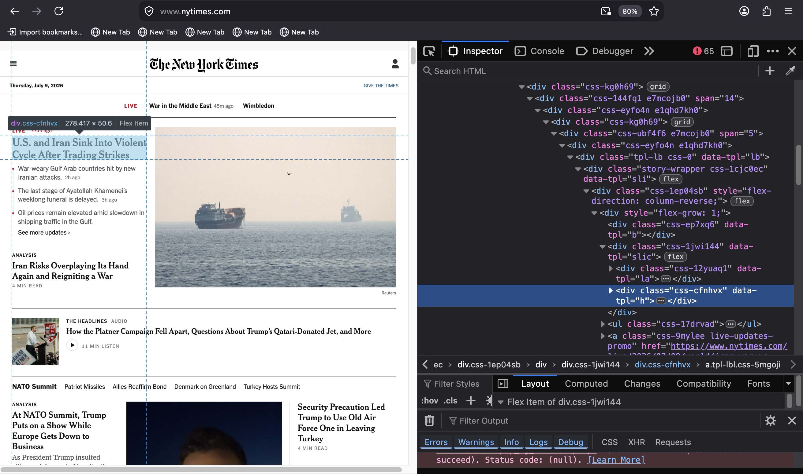
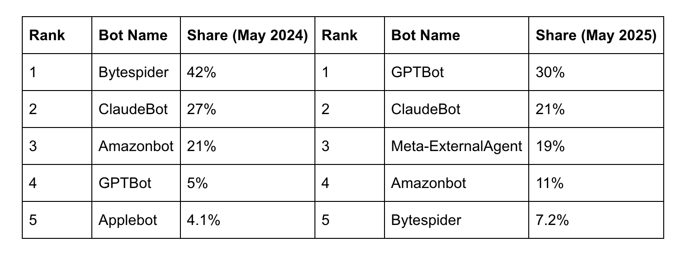
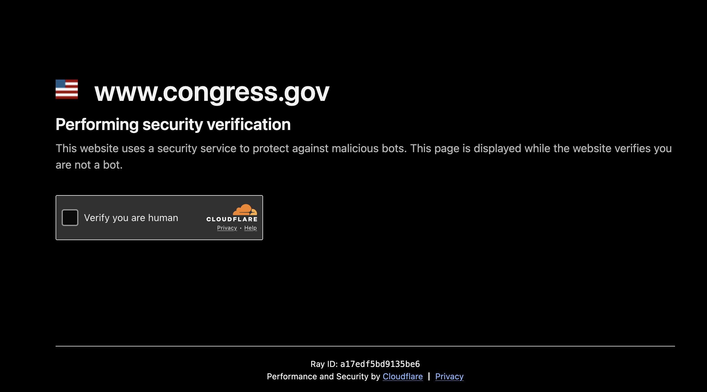

* draft: text capture

** outline
- web scraping
  - what is web scraping?
    - [ ] html, bytes
    - [ ] network, TCP/IP
    - [ ] blockers
    - [ ] theorizing standards
  - scraping congress.gov
    - 
- conclusion
  - eve sedgwick on reading practices?
  - Bowers vs Hardwick, Bostock v. Clayton County.
** draft

*** TODO what is web scraping?

**** from bytes to HTML 

Web scraping is the extraction of information from websites. It most
often involves (with some exceptions, explained below) working with
data in HTML format, with elements and attributes.

#+begin_src html
  <!DOCTYPE html>
  <html>
  <body>

  <h1 class="header">First level heading element</h1>

  
A paragraph element with a <a href="/">link</a> inside of it

  </body>
  </html>
#+end_src

Websites are stored in web servers, accessed over a network. Web data
travels over the network in the form of bytes, the smallest digitally
addressable data unit. When the bytes reach the web browser, they are
re-encoded into HTML language, which is assembled into a web page
readable by human eyes.

**** HTTP

Web /scraping/ is possible by manipulating HTTP, or HyperText Transfer
Protocol, which is the language of the network. A web scraper uses
code to manipulate an HTTP request so that it receives the website
data in the form of code.

Web scraping is, at its core, about mimicking a typical browser
request. Using HTTP protocols, it makes a request to a web server much
like a user makes a request by typing in a URL into the browser. The
data it gets back from the HTTP request is also the same as the data
that comes to a browser after searching a URL---only the data is
intercepted before in the form of bytes, rather than assembled into a
web page visible through a browser.

#+begin_src python
  r = requests.get("https://www.nytimes.com/")
#+end_src

You can scrape a website with only five lines of code. Below is an
example that scraps the home page of /The New York Times/ website
using the ~bs4~ and ~requests~ libraries in python.

#+begin_src python
from bs4 import BeautifulSoup
import requests

r = requests.get("https://www.nytimes.com/")
source = r.content
soup = BeautifulSoup(source, 'html.parser')
#+end_src

The ~requests~ library is one of the most popular libraries in the
python programing language. Enabling programs to send and receive data
through HTTP networks (i.e., the internet), it is the bedrock for
virtually all web scraping and API tasks. The ~get()~ function from
~requests~ can access the /NYTimes/ homepage, which is saved in the
form of bytes via the ~content~ property. Then, using ~bs4~, a python
library for working with HTML data, the data is parsed into an object
called ~soup~ (following ~bs4~'s naming conventions), which is a
pythonic object of HTML data. 

The beauty of ~bs4~ is that it makes HTML---a notoriously fussy
language that is the reason why so many web frameworks exist in the
first place, attempting to abstract the user from working directly in
HTML---accessible through simple python syntax.

For example, the expression ~soup.title~ returns the following output: 

#+begin_src python
  >>> soup.title
  <title data-rh="true">The New York Times - Breaking News, US News, World News and Videos</title>
#+end_src

Similarly, other HTML elements can now be accessed using python
dot syntax.

#+begin_src python console
  >>> soup.p
  
Make sense of the day’s news and ideas.

  >>> soup.a
  <a class="css-kgn7zc" href="#site-content">Skip to content</a>

  >>> soup.h1
  <h1 class="css-1dv1kvn">New York Times - Top Stories</h1>
#+end_src

Further properties like ~text~ (for just text) and functions like
~find()~ are also possible. Functions can be further specified when
combined with the ~class_~ parameter, to search the HTML with more
precision. Due to python syntax, they can also be chained together to
create complex expressions. These building blocks enable programmers
to navifate the HTML tree with granularity.

#+begin_src python console
  >>> soup.h1.text
  'New York Times - Top Stories'
  
  >>> soup.find('div', class_ = 'css-cfnhvx')
  
<a class="tpl-lbl css-5mgoji" data-tpl="l" href="https://www.nytimes.com/live/2026/07/09/world/iran-war-us-trump">

U.S. and Iran Sink Into Violent Cycle After Trading Strikes

</a>

  >>> soup.find('div', class_ = 'css-cfnhvx').text
  'U.S. and Iran Sink Into Violent Cycle After Trading Strikes'
#+end_src

HTML classes for an element can be found by using built-in browser
tools like the web inspector. On the webpage, right click on the
relevant text and select ~inspect~ from the dropdown menu. The element
will be highlighted with information for the ~class~ attribute.[fn:2]

Using ~requests~, ~bs4~, and the web inspector, one can easily grab a
list of the current headlines from the /NYTimes/ homepage.

#+begin_src python console
>>> for i in soup.find_all('div', class_ = 'css-cfnhvx'):
        print(i.text)
U.S. and Iran Sink Into Violent Cycle After Trading Strikes
Iran Risks Overplaying Its Hand Again and Reigniting a War
At NATO Summit, Trump Puts on a Show While Europe Gets Down to Business
Security Precaution Led Trump to Use Old Air Force One in Leaving Turkey
‘A Slow-Rolling Disaster’: Inside the Implosion of the Platner Campaign
What’s Next for Democrats in the Senate Race in Maine
How Democrats and Republicans Diverge on Sexual Assault Allegations
Platner Suspends Senate Bid in Maine After Rape Accusation
Trump’s Loyal Defender at the Vatican
Trump Says He’ll Ask Supreme Court to Rehear Citizenship Case, an Unlikely Event
Can Trump’s Arch Be So Tall? A Law May Be Redefined to Get to Yes.
Morocco Faces France and Its Star, Mbappé, in Quarterfinals
A Colonial Past Mixes With the Global Present
How Morocco’s Diaspora Became the Team’s Driving Force
13 Red Cards Have Been Given at the World Cup. Not All Have Been Equal.
#+end_src

Anything else to say about HTTP?

**** TODO Blockers

Web servers, unfortunately for the scraper, often block automated
requests to their data. They use various forms of "blockers" or
mechanisms that deny the HTTP request, sending back a code 403, or
"Forbidden" message.

Each year of the past few years, bot traffic has increased
exponentially, coming mostly from major tech and AI companies,
especially OpenAI, META, Google, and Anthropic. According to
Cloudflare, 2025 saw increases of 19% in bot traffic (See Fig #)
(Cloudflare, "From Googlebot to GPTBot: who’s crawling your site in
2025"). It is no surprise that traffic has increased mostly from these
companies, whose ML model training requires ever increasing amounts of
data.

As automated scrapers increase in frequency, so do the bot blockers.
Over the past two years, Cloudflare has added increasing protections
like "Challenges" and "Turnstiles" to its web pages. Most of these
challenges operate under the surface and virtually invisible to the
user: checking the HTTP request metadata like "User-Agent," which is
by default the name of the web browser and operating system making the
request. For example, on my Firefox browser running Mac OS, the
User-Agent is ~Mozilla/5.0 (Macintosh; Intel Mac OS X 10.15; rv:152.0)
Gecko/20100101 Firefox/152.0~. By contrast, the User-Agent of the
python requests library is by default set to ~python-requests/2.32.3~,
making any HTTP request using that library easy for blockers to
detect.

Additionally, javascript challenges. 

most recently, Cloudflare blockers that ask the user to check a box
for "security verification" (See Fig. 1)

There are other, more advanced forms that data takes which can be
intercepted by a knowledgable scraper, such as from requests that are
necessary to populate web pages.[fn:1]

Before, bots would lead users to original content. Now it severs the
data from the source, so that it cannot be monetized.

  “For decades, the Internet has operated on a simple exchange: search
  engines index content and direct users back to original websites,
  generating traffic and ad revenue for websites of all sizes. This
  cycle rewards creators that produce quality content with money and a
  following, while helping users discover new and relevant
  information. That model is now broken. AI crawlers collect content
  like text, articles, and images to generate answers, without sending
  visitors to the original source – depriving content creators of
  revenue, and the satisfaction of knowing someone is viewing their
  content.” (“Cloudflare Just Changed How AI Crawlers Scrape the
  Internet-at-Large; Permission-Based Approach Makes Way for A New
  Business Model”)

Cloudflare has ramped up its blocking technology.

  “In September 2024, Cloudflare introduced the option to block AI
  crawlers in a single click. More than one million customers have since
  chosen this option, meant to be an aggressive but easy solution that
  halts scraping while they determine their AI strategy.” (“Cloudflare
  Just Changed How AI Crawlers Scrape the Internet-at-Large;
  Permission-Based Approach Makes Way for A New Business Model)

As a result, Cloudflare moves to a “permission based model” that can
create a “fair exchange”.

  ““Cloudflare’s innovative approach to block AI crawlers is a
  game-changer for publishers and sets a new standard for how content
  is respected online. When AI companies can no longer take anything
  they want for free, it opens the door to sustainable innovation
  built on permission and partnership,” said Roger Lynch, CEO of Condé
  Nast. “This is a critical step toward creating a fair value exchange
  on the Internet that protects creators, supports quality journalism
  and holds AI companies accountable.”” (“Cloudflare Just Changed How
  AI Crawlers Scrape the Internet-at-Large; Permission-Based Approach
  Makes Way for A New Business Model”)

* Footnotes
[fn:2] Note that across programming languages like HTML and python,
terms like "attributes" mean different things and in practice function
very differently. In HTML, an attribute is data contained within an
HTML element, like a value specifying a CSS class, such as ~<h1
class=title>New York Times</h1>~. By contrast, in python an attribute
is information associated with an object model, like ~r.content~ or
~r.status_code~, which is data associated with an HTTP request object,
~r~.

[fn:1] Scraping XHR 
