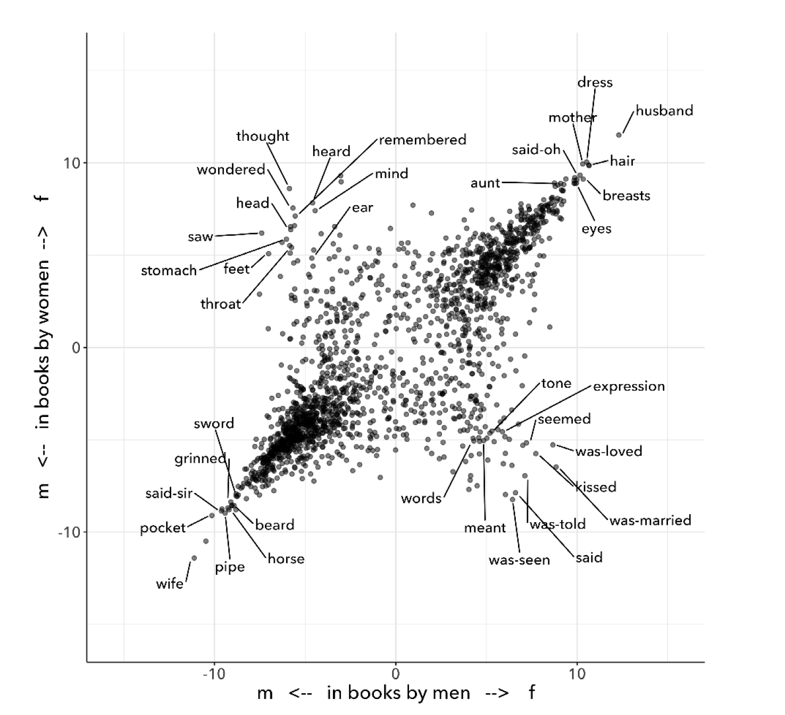

* CHAPTER TWO "Text Analysis"

** Doubt
1

The novel /Orlando: A Biography/ (1928), by Virginia Woolf, famously
opens with an assertive gender designation followed by an immediate
qualification: “He—-for there could be no doubt of his sex, though the
fashion of the time did something to disguise it" (11).

2

In order to perform quantitative text analysis on this text, the
standard tasks of "pre-processing" or "cleaning" would evacuate this
sentence of its gender qualification. Cleaning the first sentence not
only would strip it of its pronouns, including the gender assertion in
the first word, “He.” It would also cut the em dash immediately
following this “He,” signaling the entrance of the narrator and his
conspicuous certitude: “—for there could be no doubt of his sex….”
Only the following list of words would remain:

3

#+begin_quote
‘could’, ‘doubt’, ‘sex’, ‘though’, ‘fashion’, ‘time’, ‘something’,
‘disguise’
#+end_quote

Text analysis, a process which involves calculating and visualizing
textual patterns, requires transforming the source text into a
computable format. Cleaning the text strips capitalized words,
punctuation, “stop words” (such as articles and prepositions), and
inflections in word endings, all of which are deemed to be
semantically minor, and wouldn't affect the analysis of more
substantial features like nouns, verbs, adverbs, and adjectives. Text
analysis requires removing such "minor" elements of language in order
to find connections among more apprently substantial terms.

4

The so-called minor elements of the first sentence, particularly the
em dash following the "He," betrays the book's investment in gender
subversion. As Pamela Caughie points out about the first sentence,
"immediately our doubt is aroused... The emphasis on an innocent
pronoun makes it suspect" ("Double Discourse" 42). Indeed, pronouns
cannot be minor in a text about a fictional biography of a
16th-century English nobleman who lives 300 years and undergoes a sex
change. /Orlando: A Biography/ is a fantastical novel that defies
gender and genre expectations. Most famously, the main character
himself, Orlando, begins the story as a man and inexplicably changes
gender to female about halfway through the novel. Additionally,
although hundreds of years pass, Orlando doesn't age, but remains 30
old.

5

This chapter examines how quantitative text analysis works to analyze
gender by using Woolf’s /Orlando/ as a test case. It explores an
experimental approach to text analysis that deconstructs gender
binaries by drawing connections between computer programming and
gender theory. This analysis surfaces a mechanism common to both text
analysis and gender performativity, which is /iteration/. There is an
iterative method that works on both text analysis and on gender which,
I argue, can be harnessed to resignify text analysis procedures. This
chapter proposes a text analysis procedure that iterates through
various gender terms in /Orlando/, to re-signify their meaning within
binary constraints. The goal here is to work within constrictive
structures, like the gender binary, in order to unmake them from the
inside.

** Falsifiable
1

When I started graduate school in 2016, quantitative text analysis had
broken through academic circles into popular discourse. The Literary
Studies scholar responsible was Franco Moretti, who introduced many
both within and beyond the academy to "distant reading," and published
a series of polemical essays in a collection of the same name in 2008.
Distant reading, by Moretti's account, involves counting up textual
features to derive textual patterns and make inferences. It is an
analytical perspective where "distance," he explains, "is a condition
of knowledge" (/Distant Reading/ 48).

2

A /New York Times/ feature of the scholar, released in 2017, helped to
propel Moretti and distant reading to audiences beyond the academy.
However, shortly after, three former students of Moretti came forward
to accuse him of sexual crimes. The accusations ranged from
unsolicited touching to rape. At the time of the alleged incident, one
of his accusers was a first-year graduate student.
#+begin_quote
When I was a graduate student at UC Berkeley in 1984-85, my
then-professor Franco Moretti sexually stalked, pressured, and raped
me. He specifically said to me, 'You American girls say no when you
mean yes.'[...] I reported him to the Title IX officer [...] and he
threatened to ruin my career if I pressed charges against him. He said
he had powerful friends who were attorneys who would ruin my name. I
remained silent for all these years because I was in academia"
(Kimberly Latta "Op-Ed: What Happened?" 2017).
#+end_quote
When the women came forward, Stanford went no further than claiming
they would review the cases. There has been no record of an inquiry,
investigation, or any repercussions for Moretti (Liu, Knowles,
"Harassment, assault allegations against Moretti span three
campuses"). He remains an Emeritus Professor at the same institution.

3

Moretti, at the time, was riding his first wave of academic celebrity.
Invited to teach at Berkeley, he had just published a collection of
essays, /Signs Taken For Wonders: On the Sociology of Literary Forms/
(1983), a book which expressed his already polemical style and sowed
the roots of his quantitative approach to studying literature. The
first essay, "The Soul and the Harpy/," takes traditional literary
criticism as its target, critiquing the methodology of close reading.
According to Moretti, close reading is overly subjective, turning the
critic to a kind of "Narcissus", "whose only pleasure lay in
contemplating his own reflection (“Soul” 14). He proposes an
alternative, "falsifiable criticism," a methodology that pursues
answers which are irrefuatable. He asserts that,
#+begin_quote
“The day criticism gives up the battle cry ‘it is possible to
interpret this element in the following way,’ to replace it with the
much more prosaic ‘the following interpretation is impossible for such
and such a reason,’ it will have taken a huge step forward on the road
of methodological solidity” (“Soul” 22).
#+end_quote
Moretti here implicitly aligns literary criticism with methodologies
from the sciences, methods which are "reproducible."[fn:1] This kind
of methodology squashes the possibility of pesky, alternative
interpretations, in afor of conclusions which are “coherent, univocal,
and complete” (“Soul” 21).

4

20 years later, falsifiable criticism will find an ideal methodology
in quantification. Rather close attention to individual samples,
quantification is based on counting patterns across wide swaths of
text. Moretti says "we know how to read texts, now let's learn how
/not/ to read them" (/Distant Reading/ 48). Quantification, as we will
see below, simplifies text into workable units which is the basis for
higher levels of computation. These simple, workable units enable
ambitious interpreptations. Moretti explains, "If we want to
understand the system in its entirety, we must accept losing
something. We always pay a price for theoretical knowledge" (/Distant
Reading/ 49).

5

As a young graduate student, I found Moretti's writing both striking
and alluring. He is an assertive writer, using mostly short sentences
that give his prose a quick rhythm. Despite drawing from disparate
fields of knowledge, such as evolutionary theory, systems theory, and
Marxism, his arguments move at a light clip, circling methodically
around a drain so that, as long as you're following him, there appears
to be no alternative. Paragraphs begin with sentences like,
#+begin_quote
So, the market selects the canon. (69)

So. As novelistic forms travel through the literary system, their
plots are (largely) preserved, while their styles are (partly)
lost---and replaced by 'local' ones. (134)

What did the birth of a consumer society mean for the European novel?
More novels, less attention. (175)

The major metamorphosis of eighteenth-century titles is simple: in the
space of two generations, they become much, much shorter. (182)

As the market expands, titles contract; as they do that, they learn to
compress meaning; and as they do /that/, they develop special
'signals' to place books in the right market niche. (204)
#+end_quote
These sentences, taken from mostly different essays in /Distant
Reading/, synthesize arguments and evidence from previous paragraphs.
They are more summary of previous points than new argumentation. Yet,
their apparent solidity, the lack of a subjective "I" to ground them,
strikes me as suspect. It showcases Moretti's characteristic way of
transforming inferences, premises, and hypotheses into declarative
statements, stating a claim or hypothesis as an objective or
self-evident fact.

6

In one of the more famous essays from /Distant Reading/, "Style, Inc.:
Reflections on 7000 Titles (British Novels, 1740-1850)" Moretti uses
text analysis to study the market for British novels from 1740 - 1850.
Here, he explores what titles, which shorten in length over the
decades, reveal about the rise and fall of certain genres in the
market. He outlines his analytical process:
#+begin_quote
[F]irst, I describe a major metamorphosis of eighteenth-century
titles, and try to explain its causes; next, I suggest how a new type
of title that emerged around 1800 may have changed what readers
expected of novels; and finally, I make a little attempt at
quantitative stylistics, examining some strategies by which titles
point to specific genres. Three sections, three pieces in the large
puzzle of the literary field. (/Distant Reading/ 181-2; emphasis mine)
#+end_quote
Moretti's critical method involves posing hypotheses, assembling and
analyzing data, making inferences, and occasionally, reframing the
original hypotheses. Yet, he repeatedly understates his interpretive
moves at each stage of his analysis: “try to explain,” “suggest,”
"make a little attempt." As Stephen Ramsay points out, Moretti
presents his own insights as a description of reality, as if "data is
presented to us... not as something that is also in need of
interpretation" (Ramsay, /Reading Machines/ 5). His language not only
belies his own role in assembling and interpreting his data, but also
his conclusions, for example, that titles function as a proxy for
market forces, "a code, in the market: half sign, half ad... where the
novel as language meets the novel as commodity" (181). This method
misrepresents the role that inferential thinking plays in the
admittedly fascinating conclusions he draws, that titles fluctuate in
length as a response to market pressures.

7

This faith in the falsifiable--in the power of counting words--infects
even those who disavow quantitative methods. A controversial
detraction written by Nan Z. Da claims there is a "fundamental
mismatch between the statistical tools that are used and the objects
to which they are applied"--that is, to literary objects (620, 601).
Yet, despite her oppositional stance toward quantitative tools, Da has
something in common with those who champion them: she /agrees/ about
the objectivity of their procedures. As Ben Schmidt points out, “Far
more than anyone I’ve seen in any humanities article, she asserts that
scientists do something arcane, powerful, and true" (Schmidt, "A
computational critique of a computational critique of computational
critique."). Despite their vastly different views on the role of
quantitative methods for studying literature, Da and Moretti appear to
agree that these methods ought to provide results that are, at the
very least, reproducible.

8

A more precise critique of distant reading comes from Lauren Klein,
who defly argues that it overlooks details which are necessary to
cultural critique. In a talk titled "Distant Reading After Moretti,"
Klein explains,
#+begin_quote
[I]t’s not a coincidence that distant reading does not deal well with
gender, or with sexuality, or with race. Gender and sexuality and race
are precisely the sorts of concepts that have been exposed and
interrogated by attending to non-dominant subject positions. And like
literary world systems, or "the great unread," the problems associated
with these concepts, like sexism or racism, are also problems of
scale, but they require an increased attention to, rather than a
passing over, of the subject positions that are too easily (if at
times unwittingly) occluded when taking a distant view.
#+end_quote
Klein's own work tracing these elements proves how careful attention
to what is minor or oblique can surface previously suppressed stories.
In one project, Klein uses network analysis methods to bring forth the
"ghost" of a previously obscured subject, James Hemmings. Hemmings, a
slave who worked for Thomas Jefferson until he could negotiate his
freedom, appears in brief references in Jefferson's correspondence. By
marking up and visualizing these oblique references, Klein "render[s]
visible the archival silences implicit in our understanding of chattel
slavery today" (665). Her work demonstrates that the details of
Hemmings's life, which are deeply distributed in the correspondence
data, requires a kind of reading that is close and careful.

9

By contrast to this close and careful attention, distant reading is
permeated by great ambition. In /Macroanalysis: Digital Methods and
Literary History/ (2013), Matthew Jockers "ask[s] very big
questions... regarding how literary trends are employed over time,
across periods, within regions"; In /Distant Horizons: Digital
Evidence and Literary Change/ (2020) Ted Underwood traces the "larger
arcs of literary change that have remained hidden from us by their
sheer scale." Most recently, [ADD RECENT EXAMPLES, PREFERABLY
MONOGRAPHS?].

10

The ambition to grasp large swaths of literary history may be a proxy
for avoiding certain kinds of cultural critique. The proxy functions
through an amplification and valorization of what is seemingly
objective--for example, the counting of words. With word counts and
their resulting graphs and charts doing the work of analysis, one
finally closes down the pesky, subjective interpretations asssociated
with close reading. One is finally able to say, once and for all, that
"the following interpretation is impossible for such and such a
reason" (Moretti, “Soul” 22).

11

There are those, however, who disagree about the apparent objectivity
of reproducible methods. Ted Underwood, for example, explains that
"algorithms are actually bad at being objective and rather good at
absorbing human perspectives implicit in the evidence used to train
them" (“Machine Learning and Human Perspective” 92). Underwood creates
what he calls "perspectival models" of literary data, where models
represent different databases associated with different
"perspectives." In one project, on studying gender in novels,
Underwood uses a binary classification algorithm to cluster terms that
male and female writers, two "perspectives," tend to associate with
either gender. From the results, he creates a chart which visualizes
the differences between male and female writers and their treatment of
gender.

In this chart (see Fig. 1), there are two diagonals. The diagonal
moving from the bottom-left to top-right corner represents where the
genders agree on gendered terms. The bottom-left shows agreement on
terms used to describe the male gender ("pocket", "grinned"), and the
top-right shows agreement on the female gender ("eyes," "mother"). The
opposite diagonal, running from the top-left to bottom-right corners,
shows disagreement. The top-left shows terms that each gender tends to
use to describe their own gender ("wondered", "mind") and the
bottom-right shows terms that each gender uses to describe the
opposite gender ("meant", "kissed"). The chart, according to
Underwood, shows two /perspectives/ on gender--the male and the
female. Rather than making claims to gender in an objective sense, it
dramatizes a perspectival shift between the two genders.

12

Underwood's methodology, as he himself admits, reinscribes the gender
binary. When explaining the diagram, he predicts that "gender
theorists will be frustrated by the binary structure of the diagram...
I needed a simple picture, frankly, in order to explain how a
quantitative model can be said to represent a perspective" (“Machine
Learning and Human Perspective” 98). This reinscription of the "binary
structure" happens not only in the choice of model, a classification
(i.e. binary) model which makes predictions on a yes/no or, in this
case, a male/femal scale. It also happens with the choice in
visualizing the results in a way that places male and female genders
in opposition. The diagonal going from the bottom-left to the
top-right, which finds similarity between the genders, reinforces a
stereotypical active/passive binary (among other binaries) between men
and women. Similarly, the diagonal going from the top-left to the
bottom-right, although based on agreement between the genders and
their relationships to themselves, nonetheless imposes an /opposition/
between how male and female authors describe each other. The graph
effectively instantiates its implicit assumption that male and female
writers will oppose the other by visualizing this as a feature.

Beyond this reification of the gender binary, however, Underwood's
visualization effectively deploys the gender binary /as a model/ for
proving the value of quantitative methods. In order for his experiment
to take place, the gender binary is a necessary presumption, a "ground
truth," that makes the choice of a classification model appear
appropriate. In other words, before he even constructs the diagram,
gender roles have been already manufactured into opposition.

13 (this paragraph needs to be better integrated, or perhaps moved to
another section of the paper)

The gender binary is naturally and necessarily part of the large
ambitions of text analysis. As Katherine Bode argues, "Underwood’s
proposal to replace data modeling with sampling and comparison, alone
or in concert with perspectival modeling, is ultimately inseparable
from his view of the literary past as a single system of interlocking
parts" (“What’s the Matter with Computational Literary Studies?" 116).
Bode's own approach for using computation, which they use to study
Australian literature, draws from feminist physicist Karen Barad. Bode
adapts Barad's concept of "intra-action," where objects and observers
come into being through acts of observation, into computational
environments.[fn:2] Bode suggests that "we can understand our
databases or models as part of the ongoing materialisation of literary
texts as /emerging events/ always arising from an altering how the
literary pastas reconfigured" (emphasis mine; Bode, Katherine.
"Computational Modeling: From Data Representation to Performative
Materiality." ATNU/IES Virtual Speaker Series 2020/2021. Newcastle
University, UK. November 26, 2020.)

14

There are valid and provocative reasons to study gender as a binary
system. But when driven by the interest of posing one gender against
another, ("how to distinguish between male and female writers?") such
experiments end up effectively reifying the binary. Alternatively,
other work uses the binary to /deconstruct/ categorization in the
first place. For example, Laura Mandell studies gender through genre.
Mandell deploys the popular stylometry measurement, “Burrow’s Delta,”
which visualizes the “distance” between writing styles by creating
branches ("deltas") between different texts. She finds that Mary
Wollstonecraft's style is shared across comparable male writers like
William Godwin and Samuel Johnson: “Wollstonecraft’s sentimental
anti-Jacobin novels most resemble Godwin’s sentimental anti-Jacobin
novels… whereas her essays most resemble Johnson’s writings” ("Gender
and Cultural Analytics:: Finding or Making Stereotypes?" par. 29). Her
analysis creates new categories that draw gender into genre--squaring
the gender binary. She creates doubly refracted categories like, "men
writing as men," "women writing as women," "women writing as men,"
"men writing as women" (par. 35).

15

Applying text analysis to racial categories, Edwin Roland and Richard
Jean So explore whether a machine can correctly identify the race of a
novel's author. The point, they are careful to say, is not to test
whether the machine is correct, but to examine how the categories
themselves are constructed. As they explain, "the machine simply
measures the robustness of the social constructedness of these given
categories and points out what gives them such vigor" ("Race and
Distant Reading" 69). Analyzing a large corpus of novels by white and
black authors, So and Roland find that black authors generally display
more varied vocabulary than white authors. From this result, they
infer that White authorship only coheres /as a category/ against the
variance of Black authorship. In other words, White authorship is only
visible as a category when it is compared to Black authorship, which
displays overall more varied uses of language forms.

Interestingly, this quantitative exercise points Roland and So toward
a peculiarity in the results: that the algorithm wrongly categorizes
Black-authored novel, James Baldwin's /Giovanni’s Room/ (1956), as
being written by a White author. This misclassification is due to a
single word--"appalled"--whose usage, according to the model, has
generally been a signal of White authorship. The term only occurs once
in the text, in an early scene where the narrator David describes his
strained relationship to his father: “I did not want to be his buddy.
I wanted to be his son. What passed between us as masculine candor
exhausted and appalled me” (Rpt. in Roland, So 71; emphasis mine).
Given the connotation of whiteness in "appalled" and its middle French
root, “apalir” (to grow pale), Roland and So explain that this
term--which emerged as a result of the computer's mistake--enables
their analysis to coordinate gender to race: “the moment David
develops a troubled relationship to normative masculinity [as] also
the moment he becomes ‘White’” (71). Rather than reify racial
categories, this computational experiment points out that they are
constructed on certain assumptions.

16

So and Roland began with the binary form, the binary categories of
Black/White, but they ended with its fracturing. This fracturing,
evident in the computer's misclassification of authorship in
/Giovanni's Room/, leads to a reading which coordinates race with
gender and sexuality. This "queering the machine’s color line," the
authors explain, opens up new readings of intersectionality in the
novel which "in their current form, our data and model are not robust
enough to handle" (72). Rather than reproducible, this method is
fracturing and refractive, both reflecting and corrupting the
constructed nature of binary structures back at the critic. It brings
us closer to the methodology that I outline in the next section,
/iteration/.

** Iteration in gender
1

Some text analysis projects take the language of performance and
qualities of the performative to describe and conceptualize their
methodologies. For example, Mandell's project takes the behavioral
quality of gender performativity and applies it to genre, asserting
that both gender and genre "are... highly imitatable," so that "anyone
can adopt gendered modes of behavior, just as anyone can write in
genres stereotypically labeled M/F" (par. 30). For Bode, meanwhile,
the "performative" illustrates the analytical act itself, which
intervenes and becomes inseparable from the object of analysis; so
that "peformativity," they argue, is "attuned to the coconstitution of
computational methods and objects" ("What's the Matter with
Computational Literary Studies"). Their research explores how "meaning
is not carried by texts but produced in situated interactions between
readers, texts and contexts," including computational tools.[fn:3]
From the field of Computational Humanities, Kent K. Chang, Anna Ho and
David Bamman cite performativity as motivation to computationally
"measure subversion" in TV show dialogue, to predict whether samples
of a TV show, /The Big Bang Theory/, are queer-coded. 

2

My examination surfaces a particular mechanism that drives
performativity---which is the mechanism of iteration, a process of
repetition by which gender performativity both operates, and by which
it can also be exploited. This focus on iteration addresses a common
misreading of performativity, that it denotes a series of acts that
can be imitated at will. Indeed, Butler's follow up to /Gender
Trouble: Feminism and the Subversion of Identity/ (1990), which is
/Bodies that Matter: on the Discursive Limits of Sex/ (1996), aimed to
clarify how performativity is compulsory, bounded on all sides by
social norms in ways that delimit a subject's agency. In /Bodies that
Matter/, Butler explains that gender performativity is a
pre-determined procedure that /constitutes/ subjectivity: "there is no
subject who decides on its gender.... on the contrary, gender is part
of what decides the subject" (ix).

That being said, performativity can be subverted, according to Butler.
Rather than through individual will, however, subversion comes from
manipulating this iterative process. This manipulation brings
something something unexpected and extraneous into the performance,
while staying within the very terms of that performance, as I explain
below.

Crucially, in Butler's reasoning, the body only materializes (it only
/matters/) through this compulsory repetition of gender norms.

3

To understand how this possibility for subversion works, one must
first understand how the performative is constituted, according to
Butler. Essential to Butler's thinking is the poststructuralist
feminist theorist, Luce Irigaray and her methodology for critiquing
masculine language in her book, /The Sex Which Is Not One/ (Irigaray
23). Irigaray argues that philosophers like Plato, Aristotle,
Descartes, and others, represent the feminine through masculine terms,
"on the basis of masculine parameters," which is through the binary
form (18). Irigaray argues that the Male/Female binary (among other
binaries) effectively /precludes/ the representation of the other
term, the feminine. Moreover, this exclusion of the feminine, as it
happens, effectively /produces/ another feminine within the terms of
the masculinist system. In other words, the feminine which has been
excluded from the system, which must be excluded in order for that
system to work, into what Butler calls the "constitutive outside,"
makes possible the creation of the inner, "domesticated" feminine.
This feminine, which is "unspeakable" and unrepresentable, is the
/matter/ from which the Male/Female binary comes into intelligibility.

4

5

The excluded feminine is, Butler explains, a matrix. In Butler's
words,

#+begin_quote
every explicit distinction takes place in an inscriptional space that
the distinction itself cannot accomodate. Matter as a /site/ of
inscription cannot be explicitly thematized... [this] inarticulate
"matter" designates the constitutive outside of the Platonic economy;
it is what must be excluded for that economy to posture as internally
coherent (emphasis original, 12-13).
#+end_quote

This /matrix/, this "inscriptional space", which cannot be
articulated, draws simultaneously from a classical analogy between the
form/matter and masculine/feminine, in the Aristotelian tradition, and
from the etymological association between the feminine as /mater/
(mother). It is the generative material for all life, from which all
distinctions of male/female can emerge.

6

But where is this excluded feminine? If it indeed "cannot be
thematized," could it possibly be invoked, without subscribing itself
to the ruling, masculine structure? 

7

8

The answer invovles breaking open performativity's process of
repetition. Performativity describes a perpetual re-creation of norm
which works by effectively /producing/ and /re-producing/ power
structures. As Butler explains, "performativity must be understood not
as a singular or deliberate 'act,' but, rather, as the reiterative and
citational practice by which discourse produces the effects that it
names" (xii). According to Butler, it is through performativity that
"sexed" bodies emerge: "'Sex' is not a simple fact or static condition
of a body, but a process whereby regulatory norms materialize 'sex'
and achieve this materialization through a forcible reiteration of
those norms" (xii). What appears as physical or biological category is
actually a "sedimentation" formed through repetition.

9

This sedimentation, whereby meaning is signified and re-signified
endlessly, is never complete. Categories like sex, as Butler explains,
require constant repetition:

#+begin_quote
This "being a man" and this "being a woman" are internally unstable
affairs. They are always beset by ambivalence precisely because there
is a cost in every identification, the loss of some other set of
identifications, the forcible approximation of a norm one never
chooses, a norm that chooses us. (86)
#+end_quote

By this "cost in every identification," Butler means all of the
identifications which are effectively rejected when one makes a claim
to identity. Repetition stabilizes gender identity against a field of
potential exclusions. And it is these exlusions which will come back
to haunt the coherence of the identity. 

10

This mechanism of repetition, which Butler calls "iteration," creates
an excluded field of possible identities. And from this field lies the
possibility of resignifying terms. As Butler explains, every
"identification takes place through a repudiation which produces a
domain of abjection" (xiii). This domain of abjection contains
identities that are rejected whenever an identification is claimed.
These repudiated, disavowed identities offer "a field of disruptive
possibillities" which can be harnessed to destabilize the stability of
the claimed identity, as a kind of "troubling return" (Butler 10). As
Butler explains, "this disavowed abjection will threaten to expose the
self-grounding presumptions of the sexed subject" (xiii).

11

Butler offers an example with the term "queer," which is a term that
harnesses its own history of repudiation for political purposes. The
adoption of this term by Gay and Lesbian activism in the 80s and 90s
"resignif[ies] the abjection of homosexuality into defiance and
legitimacy" (Butler xxviii). This turning of abjection into legitimacy
shows how one attains some kind of agency even within the terms of
subjection.

#+begin_quote
The compulsion to repeat an injury is not necessarily the compulsion
to repeat the injury in the same way or to stay fully within the
traumatic orbit of that injury. The force of repetition in language
may be the paradoxical condition by which a certain agency---not
linked to a fiction of the ego as master of circumstance---is derived
from the impossibility of choice. (183)
#+end_quote

It is through the repetition of repudiated meanings, which necessarily
draw from insulting and/or painful pasts, come to alchemize new
significations. If a repudiated meaning, a "troubling return," is
repeated enough times, Butler argues, the stability of the original
identity will be brought into question. The paradox is that what
appears to be a cyclical or even robotic behavior takes on an agentic
capacity.

13

Returning to Irigaray, Butler explains that Irigaray achieves a kind
of subversion of the masculinist system of representation by "mim[ing]
philosophy... and, in the mime, tak[ing] on a language that
effectively cannot belong to her" (12). Butler cites a passage where
Irigaray "mimes" the style of Plato. By taking on Plato's language,
Irigaray "performs a repetition and displacement of the phallic
economy" (Butler 18). In an interesting double mimicry, with Butler
mimicking Irigaray mimicking Plato, Butler writes,

#+begin_quote
I will not be a poor copy in your system, but I will resemble you
nevertheless by miming the textual passages through which you
construct your system and showing that what cannot enter it is already
inside it (as its necessary outside), and I will mime and repeat the
gestures of your operation until this emergence of the outside within
the system calls into question its systematic closure and its
pretension to be self-grounding. (18)
#+end_quote

Irigaray undermines the authority of the masculine through repetition,
"cit[ing] Plato again and again," in a re-iterative practice (18).
This practice has a cumulative effect, which is to "expose precisely
what is excluded" from the system, and "to reintroduce the excluded
into the system itself" (Butler 18). Through iteration, one displaces
the expectation, the norm, to suggest something else. This something
else, however, is not meant to replace the norm, but to undermine its
pretensions. Butler explains that "This is a taking of his [Plato's]
place, not to assume it, but to show that it is /occupiable/... a kind
of overreading which mimes and exposes the speculative excesses in
Plato (emphasis original, 11).

12

The mechanism of iteration aims to destabilize the ruling system from
within. And this is where Butler's theory is often misunderstood. For
example, Chang et. al's text analysis project, cited above, argues
that "subversion" occurs through two straight characters whose
dialogue expresses homosexual innuendo in a popular TV show, /The Big
Bang Theory/. The authors claim that "an undercurrent of emotional
intimacy and dependency... challenges the rigid boundaries of what is
considered acceptable" on the show (Chang et al., 10). However,
according to Butler, subversion requires a destabilization from the
inside in a way that occupies and displaces the expected norm. These
characters, however much they are queer-coded, ultimately remain
within hetersexual relationships. The show thus reproduces what Butler
describes as "drag as high het entertainment":

#+begin_quote
[T]hink of Julie Andrews in /Victor, Victoria/ or Dustin Hoffmann in
/Tootsie/ or Jack Lemmon in /Some Like It Hot/ where the anxiety over
a possible homosexual consequence is both produced and deflected
within the narrative trajectory of the films. These are films which
produce and contain the homosexual excess of any given drag
performance, the fear that an apparently heterosexual contact might be
made before the discovery of a nonapparent homosexuality. (85)
#+end_quote

Butler explicitly stipulates against "forms of drag that heterosexual
culture produces for itself," which effectively prop up heterosexual
regimes. Rather than queerness as subversion, this is closer to what
Irigaray describes as the "domesticated" element. In this case,
potential subversion is domesticated by humor, which "produce[s] and
contain[s] the homosexual excess" of the show.

14

Subversion then, is a kind of /occupation/ of meaning that works
toward displacement through resemblance. It occurs by way of
overreading, as Irigaray does with her mimicry of Plato's style. The
key is repetition, or more precisely, /iteration/, a continual miming
of the authorizing norm. Through the iterative process, one brings
back again and again the repudiated meaning: through subservience,
insubordination. 

** Iteration in python

1

Iteration is a core concept in programming. Iteration means repeating
the same action to each bit of data in a collection of data. 

4

The looping mechanism quickly cleans a text and remove extraneous or
undesirable elements analysis. Elements that are highly frequent, like
articles, prepositions, and pronouns, can drown out other terms which
are considered more substantial, like nouns and verbs. Additionally,
irregular cases also need to be standardized, because capital letters
would count toward different words (for example, "talk" and "Talk"
would be considered two different words). For similar reasons, word
endings and inflections like plural forms (endings in "s") and tenses
('walked', 'walks' or 'walking') are converted into a root form. Once
the text has been regularized, then the counts will be more accurate
to its content.

Using a loop, a person may /iterate/ through each word in a text,
check whether it needs to be "cleaned," and then perform a set of
cleaning actions. For example, a first round of cleaning might check
for the presence of punctuation and capital letters. Below is an
example of a ~for loop~ that that filters out punctuation and
transforming any capital letters into lowercase forms:

#+begin_src python It therefore takes
more time to run.
  clean = [] 
  for word in text:
      if word.isalpha():
	  clean.append(word.lower())   
#+end_src

3

The loop begins by creating an empty placeholder, ~clean~, where words
will be saved in their clean form. after passing the filters below.
The next line begins the for loop, which iterates through each word in
the text, in our case, in Woolf's novel, /Orlando/. The third line
contains the first filter, ~isalpha()~, which checks if the word is
comprised of only alphabetic characters (i.e. it is not a number or
punctuation). If the word is alphabetic, it passes the filter. The
word moves to the next line, where it is lowercased, ~lower()~ and
finally added to ~clean~. When the loop is done running over every
word in the text of /Orlando/, the final list of words in ~clean~ will
only contain alphabetic and lowercased letters.

5

The next task in cleaning is to remove what are called ~stops~ or
"stop words,” which consist of prepositions, articles, pronouns, and
auxiliary verbs.

#+begin_src python
  ["i", "me", "my", "myself", "we", "our", "ours", "ourselves", "you",
   "your", "yours", "yourself", "yourselves", "he", "him", "his",
   "himself", "she", "her", "hers", "herself", "it", "its", "itself",
   "they", "them", "their", "theirs", "themselves", "what", "which",
   "who", "whom", "this", "that", "these", "those", "am", "is", "are",
   "was", "were", "be", "been", "being", "have", "has", "had", "having",
   "do", "does", "did", "doing", "a", "an", "the", "and", "but", "if",
   "or", "because", "as", "until", "while", "of", "at", "by", "for",
   "with", "about", "against", "between", "into", "through", "during",
   "before", "after", "above", "below", "to", "from", "up", "down", "in",
   "out", "on", "off", "over", "under", "again", "further", "then",
   "once", "here", "there", "when", "where", "why", "how", "all", "any",
   "both", "each", "few", "more", "most", "other", "some", "such", "no",
   "nor", "not", "only", "own", "same", "so", "than", "too", "very", "s",
   "t", "can", "will", "just", "don", "should", "now"]
#+end_src

Due to their high frequency and low semantic value in comparison to
nouns, verbs, and adjectives, and adverbs, stop words will skew the
results of analysis, so they must be removed.

#+begin_src python
  no-stops = []
  for word in cleaned:
      if word not in stops:
	  no-stops.append(word)  
#+end_src

6

The loop takes each word the ~clean~ list, and checks to see if that
word is also contained in above list of ~stops~. If the word is not a
stop word, then it will be added to a new list, ~no-stops~. After this
processing, the following words remain from the first sentence of
Orlando:

#+begin_src python
  ['could', 'doubt', 'sex', 'though', 'fashion', 'time', 'something',
   'disguise']
#+end_src

7

As mentioned in this chapter's introduction, the gender pronouns, "He"
and "his", as well as the em dash following "he" has been removed.

The final step of cleaning involves stripping word inflections to get
the word's root form, or "lemma". This process involves looking up
each word, one by one, to return the shortest lemma found. It uses the
WordNet database, an electronic lexical database used for
computational linguistics. WordNet contains every word's root form, as
well as "synsets" or synonym sets, representing underlying
relationships between words.[fn:4] In the python code, the lemmatizer
function ~lemmatize()~ is called from the ~WordNetLemmatizer~ module.

#+begin_src python
  lemmatized = []
  for word in no-stops:
      lemma = WordNetLemmatizer.lemmatize(word)
      lemmatized.append(lemma)    
#+end_src

8

The above code iterates through the list of ~no-stops~ (which has
already been stripped of punctuation, numbers, capitalization, and
stop words) and lemmatizes each individual word using the
~lemmatize()~ function. It saves the word to a new variable, called
~lemma~, which it finally appends to the list called ~lemmatized~.
After iterating through every word in the no-stops list, and
lemmatizing each one by one, the text is ready for analysis.

Text analysis is, at a most basic level, about counting words. From
counting how frequently a word appears, one can start to derive
patterns about word usage. The text analysis library Natural Language
Toolkit, or NLTK, is a python library, or collection of code, written
specifically for working with language data. Due to its modular
structure, it's a good library for beginners in Python (it was the
first library that I ever learned). NLTK comes packaged with useful
functions for simple text analysis tasks, like q ~concordance()~,
which displays the context window surrounding a given word, and
~similar()~, which finds words that are used in similar contexts to a
given word.

For example, running ~concordance()~ on the word "woman" will output
sentences that contain that word from /Orlando/:

#+begin_src
Displaying 15 of 187 matches:
ty manly charm quality old woman loved failed growing old w
en without knowing perhaps woman heart intricate ignorance 
indow pulled among cushion woman laid worn old made bury fa
red dyed cheek scarlet old woman loved queen knew man saw o
finger swore vilely master woman scarcely le bold speech le
ment panic twelve poor old woman parish today drink tea ton
perverse cruel disposition woman broke engagement night eve
verladen apple old bumboat woman carrying fruit market surr
embassy figure whether boy woman loose tunic trouser russia
ed stared boy ala boy must woman could skate speed vigour s
me standstill handsbreadth woman orlando stared trembled tu
d asked tumult emotion old woman answered skin bone trulls 
and longer full prying old woman said stared one face bumpt
 save sea bird old country woman hacking ice vain attempt d
ce melt heat pity poor old woman natural mean thawing must  
#+end_src

10

This context window reveals a text that has been stripped of
punctuation, capital letters, prepositions, articles, pronouns,
auxiliary words. What remains is largely nouns, verbs, and adverbs.
The task is to then count and analyze these remains. 

11

For that purpose, another function, called ~similar()~ displays words
that are used in similar contexts of the target word. This function
takes a canonical concept from NLP called "distributional similarity,"
where words that appear in similar contexts tend to have similar
meanings. For woman, those words are the following,

#+begin_src python 
  ['man', 'moment', 'night', 'boy', 'word', 'world', 'child' 'pen',
  'ship', 'door', 'one', 'room', 'window', 'light', 'little', 'lady',
  'table', 'book', 'queen', 'king']
#+end_src

To compute the results of ~similar()~, the program first takes the
context of the target word from ~concordance()~. Then, it counts each
of the words surrounding woman. As seen above with the ~Counter()~, it
keeps a running tally of these words. Then, it searches other words in
the database and, again, takes a count of surrounding words for these
words. It then looks for words that have the most shared contexts,
that is, the most shared words within their context window, with the
word woman. Finally, it ouputs a list of terms that share the most
contexts with the word.

12

For the program then, word meaning is computed through word counts.
Importantly, the computer does not understand or impute /meaning/ to
the words. Rather, it only counts each word as a string, that is, as a
piece of data composed of alphanumeric sequences. From there, it
derives meaning from patterns of usage.

13

That is, in a nutshell, what so-called /deep learning/ methods do.
Deep learning methods, like those that drive generative text processes
(discussed in detail in chapter 5) move from displaying the results of
word counts into generating word predictions.

Many of these methods are based on the concept of "word embeddings" or
"word vectors" to ascribe machine-interpretable meaning to strings.
Like ~similar()~ and ~concordance()~, word embeddings work from
patterns of word similarity based on context. Unlike the previous
methods, however, word embeddings encode precise numeric values to a
given word based on its context.

14

A vector for a single word, “woman,” like the one below, will contain
a list of numbers that represent a high similarity score between
“woman” and another word.

#+begin_src python
['child', 0.9371739625930786, 
'mother', 0.9214696884155273, 
'whose', 0.9174973368644714, 
'called', 0.9146499633789062, 
'person', 0.9135538339614868, 
'wife', 0.9088311195373535, 
'being', 0.9037441611289978, 
'father', 0.9028053283691406, 
'guy', 0.9026350975036621, 
'known', 0.8997253179550171,
...]  
#+end_src

Based off a popular model trained from twitter posts, the vector which
represents “woman” contains a list of numbers that score the
similarity of the word “woman” to other words in the dataset. Here,
the word “woman” is most closely associated to the word “child,” with
a similarity score, or “weight,” of .93, or 93%, then with “mother,”
with .92, then “father,” with .90, and so on.

15

Commonly, word vectors are organized into a matrix, or tabular,
format. Using this matrix format, further mathematical operations are
possible using statistics, linear algebra, and calculus—-the building
blocks of deep learning methods.

The inventors of word vectors introduced their power to the world via
a formula that uses math to compute language meaning (Mikolov et al.
2013). The famous formula uses a mathematical equation to calculate
the meaning of the word "Queen". Here, the vector for the word "queen"
is calculated by subtracting the vectors of "man" from "king," and
finally, adding the vector for "woman."

#+begin_quote python
vector("Queen") = vector("King") - vector("Man") + vector("Woman")
#+end_quote

The cross-cultural intelligibility of this formula, which introduced
word vectors to the world, cannot be understated. Gender, which is
necessarily imbricated with imperialist concepts, becomes an operand
for computing language meaning. Like Ted Underwood's graph which puts
gender into an oppositional relationship, gender is the /model/ which
shows the algorithm to be true.

They are called "vectors" because these numeric values represent
points in a graph. By graphing word similarity, word vectors translate
relationships of word context into geometric space.

Like Butler's matter or /matrix/ which produces the binary of
masculine/feminine, here is another matrix that produces meaning
according to masculinist parameters. The matrix format of the word
vector enables a host of mathematical operations and algorithms: from
example, cosine similarity calculates the distance between two
vectors, that is, two words; and regression analysis guesses the
relationship between an independant and dependant variable, or
relation between one word and another.

16

In the following section, I use these word vectors as a starting point
to explore terms related to gender terms in Orlando, starting with the
terms “woman” and “man.” Although I start with the gender binary, word
vectors enable me to quickly proliferate beyond it. Rather than
resolving gender into an oppositional structure or a neat formula, it
cracks open.

** Fluidity
1 

But it is more than Orlando the character who defies realist
expectations. As Woolf scholar Pamela Caughie puts it, "The text of
Orlando is as unstable as the sex of Orlando" (42). Subtitled /A
Biography/, /Orlando/ draws from English takes real life as its source
material--except it re-works this material into what critics Christy
Burns and Jane de Gay describe as parody and satire.[fn:5] First,
English literary history is reproduced and satirized, with each
chapter of the novel taking different periods like the Elizabethan,
Restoration, and Victorian periods, and featuring (and mocking)
characters like Queen Elizabeth and Alexander Pope. Moreover, the
model for Orlando's character comes from Virginia's friend and lover,
Vita Sackville-West.[fn:6] Episodes from Sackville-West's real life,
like her heartbreak with the author Violet Trefusis and her
disinheritance of the family estate at Knole are represented in
Orlando's heartbreak with Sasha and (after her transition) her legal
battles over her property and titles. According to critics

The most unstable element of the text, however, is the language, whose
experimental quality evokes its peers in the early modernist canon.
According to Caughie,

#+begin_quote
In its rhetorical transports, Woolf's novel challenges the reference
theory of meaning. In particular, it questions the notion *that words
get their meanings from things they refer to*; the definition of words
and categories by their essential traits; and the isolation of words
and statements from their contexts of use in order to interpret them.
(Caughie, "Double Discourse, 44-45).[fn:7]
#+end_quote

I agree with Caughie that language's referential power is a major, if
not the central, problematic in /Orlando/. However, unlike Caughie,
who positions the main character's gender fluidity as the cause of
language's instability, I explore the opposite movement: following
Butler, this reading poses language forms as determining and producing
gender norms and their re-signification.

2

Crucially, for Butler, re-signification works through iteration, which
is repetition with a difference. For the following close reading, I
pursue an /iterative/ text analysis method that runs the same
quantitative computation over and over again, with slight difference:
it intersperces quantitative analysis with close reading, dipping in
and out of the text to examine words in their original context. This
toggling between close and distant views of language in the novel
recalls a procedure that Andrew Piper calls "bifocal" reading, which
"explicitly constructs the context through which something is seen as
significant" (17).[fn:8] Unlike Piper, however, who uses the
quantitative component to "cede" "some measure of subjectivity" to the
critical process, this method explicitly embraces the critic's
inclinations as the driving force of analysis. Inclination, including
those motivated by pleasure and surprise, will be essential to divert
the expected path of gender's supposed reproducibility.

3

I begin with two gender terms from the novel, "woman" and "man." Using
word vectors, and the ~Word2Vec~,[fn:9] library in python, I compute
words used in similar contexts. The function to compute similar words,
written below, uses cosine similarity to caculate the graphical
distance between two words, represented as vectors. In other words,
the function searches for words that appear with similar coordinates
to "woman" and "man" in vector space.[fn:10]

#+begin_src python
  woman_similar = model.wv.most_similar(positive = "woman", negative = "man")

  man_similar = model.wv.most_similar(positive = "man", negative = "woman")
#+end_src

To make sure that the outputs of this calculation consist of that are
most characteristic of each gender, I defined the female term in
direct opposition to the male terms. In the code expression, I added
parameters specifying the most "positive" and "negative" associations
between the genders. The results, then, show words that are most
distinctive for each gender, most strongly correlating to "woman"
while also being distant from "man" in vector space.[fn:11] I saved
these similar words in separate lists called ~woman_similar~ and
~man_similar~, as seen below.

#+begin_src
woman_similar:

[(‘soft’, 0.3692586421966553), 
(‘named’, 0.34212377667427063), 
(‘sciatica’, 0.3223450779914856), 
(‘frilled’, 0.3187992572784424), 
(‘despaired’, 0.31375786662101746), 
(‘friend’, 0.31238242983818054), 
(‘delicious’, 0.30853813886642456), 
(‘winked’, 0.30514153838157654), 
(‘notion’, 0.3047487139701843), 
(‘seductiveness’, 0.30290719866752625)]
#+end_src

#+begin_src
man_similar:

[(‘chequered’, 0.4025157392024994), 
(‘fact’, 0.3394489586353302), 
(‘denounced’, 0.3346075117588043), 
(‘house’, 0.33423593640327454), 
(‘curiosity’, 0.33144116401672363), 
(‘defend’, 0.3284823000431061), 
(‘dancing’, 0.3282632827758789), 
(‘marbling’, 0.3184848427772522), 
(‘cynosure’, 0.3057470917701721), 
(‘rather’, 0.3024100363254547)]   
#+end_src

Readers may note that like Underwood's project, this analysis begins
with an oppositional formulation of gender, one that places male and
female into a positive/negative axis. However, the goal of this
analysis is not to reproduce or reify the binary: rather, it is to
bring forth what has been repudiated by each term. Like Butler's
reading of "queer," this analysis finds that the female and male
genders are constituted by certain /exclusions/ which define the
other. In what follows, I read into a selection of these terms,
examining them in context, to seek out what constitutes their meaning
and, eventually, what must be repudiated in order for them to signify.

5

For example, term "delicious." This term only occurs five times in the
novel, and only after Orlando transitions into a woman. Three of these
occurances appear in a single passage, when Orlando is sailing from
Turkey back to her native England. In this passage, the ship captain
offers Orlando a slice of beef. After politely refusing, Orlando
launches into a rapturous speculation on the joys of womanhood.

#+begin_quote
‘A little of the fat, Ma’m?’ he asked. ‘Let me cut you just the
tiniest little slice the size of your fingernail.’ At those words a
/delicious/ tremor ran through her frame. Birds sang; the torrents
rushed. It recalled the feeling of indescribable pleasure with which
she had first seen Sasha, hundreds of years ago. Then she had pursued,
now she fled. Which is the greater ecstasy? The man’s or the woman’s?
And are they not perhaps the same? No, she thought, this is the most
/delicious/ (thanking the Captain but refusing), to refuse, and see
him frown. Well, she would, if he wished it, have the very thinnest,
smallest shiver in the world. This was the most /delicious/ of all, to
yield and see him smile. ‘For nothing,’ she thought, regaining her
couch on deck, and continuing the argument, ‘is more heavenly than to
resist and to yield; to yield and to resist. (emphasis mine, 114)
#+end_quote

6

Delicious, which is repeated insistently, conspicuously, in this
passage, describes a distincly feminine kind of pleasure. In this
context, its novelty comes from the opposition to pursuit, here posed
as the active form of pleasure proper to the man, that which Orlando
enjoyed as a man when he seduced the Russian princess, Sasha. In
contrast to the active pleasure of the pursuer, this passive, feminine
pleasure is about withholding and, eventually, submitting. Yet, it is
not totally passive: it betrays a kind of power, the power in
vascillating between refusal and acquiescence, "to resist and to
yield" (114).

7

I run another similarity search, iterating on the term "woman," but
this time, with "delicious" as the target word. The top result, the
word most related to “delicious” in the text, is "culpable." As it
happens, this term occurs in the same scene as above, when Orlando is
ruminating on the differences between the sexes on the ship. In this
section, Orlando considers what her change in sex means for her
sexuality:

#+begin_quote
And as all Orlando’s loves had been women, now, through the /culpable/
laggardry of the human frame to adapt itself to convention, though she
herself was a woman, it was still a woman she loved; and if the
consciousness of being of the same sex had any effect at all, it was
to quicken and deepen those feelings which she had had as a man.
(emphasis mine, 119)
#+end_quote

8

“Culpable,” from the Latin “culpa,” means fault or blame. In this
context, the term modifies the phrase, "the laggardry of the human
frame," that is, the human body, "to adapt itself to convention," to
the convention heterosexuality, of the female's desire for the male.
Like "delicious" above, "culpable" also describes kind of refusal, a
refusal to conform to social expectations. But instead of associating
refusal with power, it associates it with sexuality. Indeed, this
sentence is one of the few in the novel (in all of Woolf's fiction)
where homosexuality is considered in explicit terms--"it was still a
woman she loved."

The iteration from "delicious" to "culpable" thus models femininity
through descriptions of power and passion. If femininity is
constituted by these terms, what then constitutes masculinity? 

10

Masculinity, as it turns out, is constituted by division. Moving to
the terms associated with "man," I begin with the term "chequered,"
which appears only once, in the first few pages of the story. Here,
after describing Orlando's aristocratic lineage ("His fathers had been
noble since they had been at all. They came out of the northern mists
wearing coronets on their heads"), the narrator paints Orlando
stepping into "the yellow pools which /chequered/ the floor, made by
the sun falling through the vast coat of arms in the window" (12). His
depiction then veers into lush and exagerrated language.

#+begin_quote
Orlando stood now in the midst of the yellow body of an heraldic
leopard. When he put his hand on the window-sill to push the window
open, it was instantly coloured red, blue, and yellow like a
butterfly's wing. Thus, those who like symbols [...] might observe
that though the shapely legs, the handsome body, and the well-set
shoulders were all of them decorated with various tints of heraldic
light, Orlando's face, as he threw the window open, was lit solely by
the sun itself. 12
#+end_quote

11

The image of Orlando's body cut or /chequered/ into different colored
pieces is indeed a symbol, but one of division rather than nobility.
This is a condition exacerbated by the narration, which soon gallops
into full-fledged figuration:

#+begin_quote
Directly we glance at Orlando standing by the window, we must admit
that he had eyes like drenched violets, so large that the water seemed
to have brimmed in them and widened them; and a brow like the swelling
of a marble dome pressed between the two blank medallions which were
his temples. Directly we glance at eyes and forehead, thus do we
rhapsodize. Directly we glance at eyes and forehead, we have to admit
a thousand disagreeables which it is the aim of every good biographer
to ignore. 12-13
#+end_quote

It bears noting that this scene is the first in many scenes in the
novel where the narrator, a self-described "scribe," committed to
straightforward description, calls into question his credibility as a
biographer. When trying to describe Orlando's beauty, he endows it
with mystical qualities--his eyes like flowers, his forehead like
marble. The narrator’s evocative language undermines his own pretense
to objectivity.

12

These momentary slips into figurative language grow into a crisis of
signification that recurs persistently through the novel, and entwine
with Orlando's own thoughts. Take another term from the list of
"woman" vectors, "despaired." Like "chequered," this term occurs in a
scene where the line between fiction and reality become blurred. In
this scene, Orlando is in the midst of a period of depression
following his abandonment by the Russian princess, Sasha. He is lying
beneath his favorite Oak tree, ruminating about the meaning of truth,
love, and above all, language itself.

#+begin_quote
‘The sky is blue,’ he said, ‘the grass is green.’ Looking up, he saw
that, on the contrary, the sky is like the veils which a thousand
Madonnas have let fall from their hair; and the grass fleets and
darkens like a flight of girls fleeing the embraces of hairy satyrs
from enchanted woods. ‘Upon my word,’ he said (for he had fallen into
the bad habit of speaking aloud), ‘I don’t see that one’s more true
than another. Both are utterly false.’ And he despaired of being able
to solve the problem of what poetry is and what truth is and fell into
a deep dejection. 75
#+end_quote

13

Like the narrator, Orlando struggles with the referential qualities of
language. First, he attempts plain language, "the sky is blue,” “the
grass is green.” But these prove insufficient to describe a sky of
"veils [from] a thousand Madonnas" and grass that “fleets and darkens"
like "girls fleeing." Orlando, like the narrator, cannot make language
do the work of expression. So he must turn to figurative elements,
comparisons of feminine subtlety and evasion which betray his pain
from being recently abandoned by a woman. If in the previous scene,
Orlando was divided by different colors of light, here he appears
divided by doubt about language and its pretention to describe
reality.

13.1

He is divided, that is, until he becomes a woman. In chapter six, a
scene which mirrors this one under the Oak tree appears to resolve the
the crisis of signification. Orlando, now a woman, watches a toy boat
on the Serpentine river in Hyde Park, London. The toy boat incites a
waking vision of Shel, her gender-bending husband, who is a sailor:
"as she watched the toy boat climb the ripple, she thought she saw
[his] ship climb up and up a glassy wall" (PAGE NUMBER). Her thinking
climaxes when she sees the little boat make it to the other side of
the wavelet.

#+begin_quote
'Ecstasy!' she cried. 'Ecstasy! Where's the post office?' she
wondered. 'For I must wire at once to Shel and tell him...' And
repeating 'A toy boat on the Serpentine', and 'Ecstasy', alternately,
for the thoughts were interchangeable and meant exactly the same
thing, she hurried towards Park Lane.

'A toy boat, a toy boat, a toy boat,' she repeated, thus enforcing
upon herself the fact that it is not articles by Nick Greene on John
Donne nor eight-hour bills nor covenants nor factory acts that matter;
it's something useless, sudden, violent; something that costs a
life... that's what it is--a toy boat on the Serpentine, ecstasy--it's
ecstasy that matters. PAGE NUMBER
#+end_quote

She hurries to telegram the phrases, "a toy boat on the serpentine"
and "ecstasy," to Shel, whom she knows will immediately understand
what it means. She realizes that language, its power, is violently
ecstatic. If before, under the Oak tree, Orlando struggled to describe
reality in plain language, now she has the significatory power to
equate two apparently unrelated terms.

14

An interesting, final example shows how close language and gender are
in the novel. Words from both the “woman” and “man” lists of vectors
occur within a single passage, the scene where Orlando first meets his
beloved Sasha. The words “curiosity,” from the “man” list, and
“seductiveness," from the "woman" list, appear together in Orlando's
tumultuous and agonizing attempt to determine Sasha’s gender. Upon
seeing Sasha for the first time, cannot tell whether she is a man or a
woman:

#+begin_quote
He beheld, coming from the pavilion of the Muscovite Embassy, a
figure, which, whether boy’s or woman’s, for the loose tunic and
trousers of the Russian fashion served to disguise the sex, filled him
with the highest curiosity. The person, whatever the name or sex, was
about middle height, very slenderly fashioned, and dressed entirely in
oyster-coloured velvet, trimmed with some unfamiliar greenish-coloured
fur. But these details were obscured by the extraordinary
seductiveness which issued from the whole person. Images, metaphors of
the most extreme and extravagant twined and twisted in his mind. He
called her a melon, a pineapple, an olive tree, an emerald, and a fox
in the snow all in the space of three seconds; he did not know whether
he had heard her, tasted her, seen her, or all three together. (For
though we must pause not a moment in the narrative we may here hastily
note that all his images at this time were simple in the extreme to
match his senses and were mostly taken from things he had liked the
taste of as a boy. But if his senses were simple they were at the same
time extremely strong. To pause therefore and seek the reasons of
things is out of the question)... A melon, an emerald, a fox in the
snow—--so he raved, so he stared. When the boy, for alas, a boy it
must be–--no woman could skate with such speed and vigour—--swept
almost on tiptoe past him, Orlando was ready to tear his hair with
vexation that the person was of his own sex, and thus all embraces
were out of the question. 27-28
#+end_quote

Orlando uses seemingly arbitrary metaphors, "A melon, an emerald, a
fox in the snow," indicating that at the same time which he cannot
place Sasha’s gender, he also cannot find the right words to describe
her. This dynamic between gender and language is further developed in
the narrative form of the passage: as Sasha's gender oscillates
between male and female, so the perspective alternates between
Orlando’s interiority and the narrator’s commentary. In particular,
the insertion of the narrator’s "pause," a pause which purports to
explain Orlando's arbitrary metaphors, signals a breach in the
diegetic narrative, which reinforces the constructed quality of the
scene. By the end, it is fair to say that both gender and language are
illustrated as pliant material, one that can be put toward various
uses and expressions.

15

Taking words from both the female and male lists of vectors, this
passage suggests that the two genders intersect via language's
unstable, expressive qualities. Gender, like language, is /fluid/. As
a thematic, this fluidity has been well documented by critics: Caughie
claims that "Woolf brings out the arbitrariness of [sexual] identity,
the arbitrariness of language itself, through Orlando’s switching from
one sex to the other... as well as through the shifting of her own
rhetoric in this novel" (42); Victoria L. Smith asserts that "what
happens in the novel... and what it thematizes—-language’s inability
to adequately represent the ‘thing itself’—-mirrors the undecidability
of the text--is it a biography, an autobiography, fantasy, etc." (58).
The above passage, with its “switching” and “shifting” discourse,
which asserts that word choices are arbitrary and flowing, implies
that gender is also a fluid phenomenon.

In this analysis, fluidity is brought forth through close readings of
specific terms, "delicious," "culpable," "chequered," "despaired," and
in the longer passage, "seductiveness" and "curiosity." For the terms
similar to "woman," gender is constituted by a reclamation of feminine
refusal into sign of power more than passivity. The masculine gender
is constituted through an association with division, which spreads
from Orlando's interior experience to the extradeigetic layer of the
narration. Orlando's division points to the novel's larger crisis of
signification, which appear to resolve when Orlando becomes a woman.
What is divided in the male appears to be resolved in the female. In
the end, the repudiated meaning of gender, the meaning which is being
brought back through is fluidity.

16

The iterative reading practice brings these meanings of gender to the
surface. The lists of word vectors offer starting points for isolating
passages throughout the text. As the reader moves from distant to
close, from a word vector to its context, the meanings of certain
words gain new significations.

** Conclusion

Like /Orlando/'s narration, there is something conspicuous about my
own presentation of facts. Attentive readers of /Orlando/ will know
that I left out the second half of the first sentence. The rest of the
first sentence, "—was in the act of slicing at the head of a Moor
which swung from the rafters” (11)."

Race, and the body, is elided in this analysis.

According to Jamie Hovey, gender and nationality are constructed via
race and sexuality. "Sexuality and other dimensions of identity, such
as nation and race, are seen as performed through gender" (Hovey 397).

"Beginning with an image of a decapitated Moor, Orlando appropriates
the exoticized subjects of colonial discourse to create for its
protagonist a sexuality that is not bourgeois or heterosexual.
However, Orlando's playful but insistent production of white
femininity allows the protagonist to pass as respectable and
heterosexual by displacing her transgressive sexuality onto racial
others, thereby masking Orlando's masculine-identified literary and
sexual desires." (Hovey 398).

2

This elision is because there is a limitation to Butler's theory.
Common critiques of Butler point out the limits of this theory for
posing gender and sexuality as discursive. 

3

According Jay Prosser, Woolf’s experimentation with language and
narrative form belies the embodied reality of transsexuality. He
argues that “Orlando is not about the sexed body at all but the
cultural vicissitudes of gender. As h/er narrative propels h/er
through four centuries of history, Orlando is free to move beyond h/er
body–quite queerly, to break through the limits of the flesh” (Prosser
168). By “the sexed body,” Prosser means the physical body that exists
in a physical world. Orlando’s transgressiveness, Prosser argues,
results from a play of language and literary form that elides the
specificity and the lived reality of the “sexed body.” 

4

A decade later, Omise’eke Natasha Tinsley writes about the problem of
gender fluidity as a metaphor. In her essay, “Black Atlantic, Queer
Atlantic: Queer Imaginings of the Middle Passage,” Tinsley argues for
the imbrication of sexuality and race through the lens of the Black
Atlantic.

Her critique re-works the trope of fluidity which, drawing from the
ocean, “is not an easy metaphor or queer and racially hybrid
identities but for concrete, painful, and liberatory experience”
(192-193). For Tinsley, fluidity is an opportunity for “a return to
the materiality of water to make its metaphors mean more complexly,
shaking off settling into frozen figures” (212). Tinsley theorizes
fluidity as a “social liquidation,” being stripped by the water,
particulars of identity washed away in the current. She explains that
“brown bodies are gender fluid not because they choose parodic
proliferations but because they have been ‘washed of all this lading,
bag and baggage’” (209).

This is taken up in chapter four on the flesh.

* Footnotes

[fn:1] Sarah Cohen-Boulakia, Khalid Belhajjame, Olivier Collin, Jérôme
Chopard, Christine Froidevaux, Alban Gaignard, Konrad Hinsen, Pierre
Larmande, Yvan Le Bras, Frédéric Lemoine, Fabien Mareuil, Hervé
Ménager, Christophe Pradal, Christophe Blanchet, Scientific workflows
for computational reproducibility in the life sciences: Status,
challenges and opportunities, Future Generation Computer Systems,
Volume 75, 2017, Pages 284-298, ISSN 0167-739X
https://doi.org/10.1016/j.future.2017.01.012.

[fn:2] In fact, Barad takes up the concept of performativity which
she, like Butler, traces through Derrida and JL Austin. Barad,
however, describes their application as "a diffractive elaboration of
Butler's... critical insights" (Barad, Posthumanist Performativity,
/Signs/ 2003, page 808). In contrast to Butler's focus on citation,
Barad emphasizes relation and intra-action. See Barad, "Nature's Queer
Performativity," 2012, footnote 27 on page 49.

[fn:3] Bode, Katherine. “Data beyond representation: From computational
modelling to performative materiality.” MLA Convention, Seattle, 10
January 2020.
https://katherinebode.wordpress.com/home/mla-convention-2020/

[fn:4] Christiane Fellbaum (1998, ed.) WordNet: An Electronic Lexical
Database. Cambridge, MA: MIT Press.

[fn:5]  Burns, Christy L. “Re-Dressing Feminist Identities: Tensions
between Essential and Constructed Selves in Virginia Woolf's Orlando.”
*Twentieth Century Literature*, vol. 40, no. 3, 1994, pp. 342–364.
*JSTOR*, www.jstor.org/stable/441560; De Gay, Jane. "Virginia Woolf's
feminist historiography in Orlando." Critical Survey, vol. 19, no. 1,
2007, p. 62+.

[fn:6] “‘If I Saw You Would You Kiss Me?": Sapphism and the
Subversiveness of Virginia Woolf's Orlando.” /PMLA/, vol. 103, no. 1,
1988, pp. 24–34. www.jstor.org/stable/462459

[fn:7] Pamela Caughie. “Virginia Woolf’s Double Discourse.”
Discontented Discourses : Feminism/textual
Intervention/psychoanalysis. Ed. Marleen S. Barr & Richard Feldstein.
Urbana, IL: University of Illinois Press, 1989. 41–53.

[fn:8] Andrew Piper, /Enumerations/, University of Chicago
Press, 2019. page 18.

[fn:9] Link to Word2Vec source code:
https://radimrehurek.com/gensim/models/word2vec.html#gensim.models.word2vec.Word2Vec

[fn:10]  The documentation describes ~similar_words()~ "computes
cosine similarity between a simple mean of the projection weight
vectors of the given keys and the vectors for each key in the model...
correspond[ing] to the word-analogy and distance scripts in the
original word2vec implementation.". Link to most_similar() source
code:
https://radimrehurek.com/gensim/models/keyedvectors.html#gensim.models.keyedvectors.KeyedVectors.most_similar

[fn:11] Link to file from this project's source code:
https://github.com/gofilipa/qdr/blob/master/lib/actions.py

[fn:12] Criticism of the novel about gender and story.

[fn:13] link to source Counter (python) code:
https://github.com/python/cpython/blob/main/Lib/collections/__init__.py;
link to source code in C language:
https://github.com/python/cpython/blob/main/Modules/_collectionsmodule.c

[fn:14] De Gay, Jane. “Virginia Woolf’s Feminist Historiography In
Orlando.” /Critical Survey/, vol. 19, no. 1, 2007, p. 62+.

[fn:15] "'Ransacking the Language': Finding the Missing Goods in
Virginia Woolf's Orlando." Journal of Modern Literature, vol. 29 no.
4, 2006, pp. 57-75. Project MUSE, doi:10.1353/jml.2006.0050

[fn:16] Channing, Jill. "Magical realism and gender variability in
Orlando." Virginia Woolf Miscellany, no. 67, 2005, p. 11+.

[fn:17] Jessica Berman, "Is the Trans in Transnational the Trans in
Transgender?" /Modernsim/Modernity/, vol 24, no 2, 2017. 217-244.
